# Neural networks from A to Z

[](https://github.com/cfdgasman/classic-nn/actions/workflows/ci.yml)

A step-by-step, hands-on course that takes you from **a single artificial neuron** to
**transformers** and **scientific machine learning** (physics-informed networks, neural
surrogates of PDE solvers, VAEs and diffusion models). Every lesson is a numbered folder with

* a runnable, heavily commented **script** (`lessons/NN_topic/lesson.py`) that explains the idea,
  derives the maths and implements it,
* a **Jupyter notebook** (`notebooks/NN_topic.ipynb`) that walks through the same lesson cell by
  cell, with the figures inline,
* **figures and GIFs** saved to `docs/lessonNN/` and the numbers of the run saved to
  `docs/results/lessonNN.json` (the tables below are generated from these files by `run.py`).

Everything runs on a laptop **CPU in minutes**. The first three lessons use only NumPy, so every
gradient is derived and coded by hand before we let PyTorch's autograd do it for us.

<p align="center">
  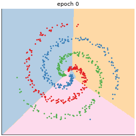
  
  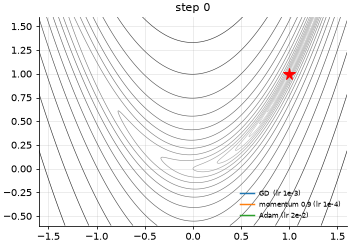
</p>

---

## Contents

1. [Learning path](#learning-path) - which lesson answers which question
2. [Quick start](#quick-start)
3. [Notation and the three ideas everything rests on](#notation-and-the-three-ideas-everything-rests-on)
4. [Lesson 01 - The single neuron](#lesson-01--the-single-neuron-perceptron-and-logistic-regression)
5. [Lesson 02 - An MLP from scratch](#lesson-02--a-multilayer-perceptron-from-scratch-in-numpy)
6. [Lesson 03 - Training craft](#lesson-03--training-craft)
7. Lessons [04](#lesson-04--pytorch-basics) … [16](#lesson-16--reduced-order-modelling-for-cfd-pod-vs-a-convolutional-autoencoder)
8. [Lessons learned / bugs found](#lessons-learned--bugs-found)
9. [Repository layout and tests](#repository-layout-and-tests)
10. [References](#references)

## Learning path

| # | Lesson | The question it answers | Key result (real run) | Status |
|---|---|---|---|---|
| 01 | [Perceptron / single neuron](lessons/01_perceptron) | What does one neuron compute, how does it learn, and how do I derive and *check* a gradient by hand? | hand gradient = finite differences to 1e-9; GD reaches the exact L-BFGS optimum; fails on XOR | ✅ |
| 02 | [MLP from scratch (NumPy)](lessons/02_mlp_numpy) | What *is* backpropagation, and how do I prove my implementation is right? | gradient check < 1e-6 for every layer type; spirals 33 % → 100 % | ✅ |
| 03 | [Training craft](lessons/03_training_craft) | Why does a deep net not train, and what do initialisation, ReLU, momentum/Adam, schedules, batch norm, dropout fix? | BN rescues a 10-layer sigmoid net; regularisation +6 % val. accuracy under label noise | ✅ |
| 04 | [PyTorch basics](lessons/04_pytorch_basics) | What does autograd do, and how do I write a clean training loop? | NumPy and PyTorch agree to 4e-16 over 300 steps (and diverge when GD turns chaotic) | ✅ |
| 05 | [CNNs on MNIST / Fashion-MNIST](lessons/05_cnn_mnist) | Why convolutions for images, and what do the filters learn? | **99.2 %** on MNIST with 80 k parameters, ~90 % on Fashion-MNIST | ✅ |
| 06 | [RNN / LSTM forecasting](lessons/06_rnn_lstm) | Can a recurrent net forecast a nonlinear oscillator better than a linear model? | LSTM beats persistence and linear AR; closed-loop 150-step error 3× lower than AR | ✅ |
| 07 | [Autoencoders](lessons/07_autoencoders) | What does a bottleneck learn; is a linear autoencoder just PCA? | linear AE within 0.1-0.6 % of the SVD optimum; non-linear AE halves the error | ✅ |
| 08 | [Attention → tiny GPT](lessons/08_attention_gpt) | How does self-attention work, and how does a GPT generate text? | from-scratch attention = PyTorch; 0.8 M-param GPT: 1.61 vs 2.48 nats/char (bigram) | ✅ |
| 09 | [Scientific ML: PINN + surrogate](lessons/09_scientific_ml) | Can a network solve a PDE (Burgers) without data, and emulate a solver? | PINN **1.3e-3** rel. error vs exact Cole-Hopf; surrogate vs interpolation, honestly | ✅ |
| 10 | [Generative models: VAE + diffusion](lessons/10_generative) | How do we *sample* new data? | VAE 77 vs 200 nats (independent pixels); DDPM score checked against the exact formula | ✅ |
| 11 | [Self-organising maps + Hopfield networks](lessons/11_som_hopfield) | Can a network organise data without labels, and what do feedback loops compute? | SOM topographic error 0.085; Hopfield capacity collapses near 0.138 N; modern Hopfield = attention | ✅ |
| 12 | [Differentiable Neural Computer](lessons/12_dnc_memory) | How can a network use an external, differentiable memory? | DNC copies sequences 2.4× longer than trained on (error 0/2 %); the LSTM fails | ✅ |
| 13 | [Graph neural networks on meshes](lessons/13_graph_nn_mesh) | How do networks work on unstructured (FEM/CFD) meshes? | spatial MPNN vs spectral GCN vs FEM (P1 FEM verified at order 2.1) | 🚧 |
| 14 | [Neural operators: DeepONet + FNO](lessons/14_neural_operators) | How do we learn a whole PDE solution operator? | FNO **0.24 %**, DeepONet 3.6 %, best linear operator 61 %; FNO works on a 4× finer grid | ✅ |
| 15 | [Hamiltonian NNs + neural ODEs](lessons/15_hamiltonian_neural_ode) | How do we build physics (energy conservation) into a network? | HNN vs plain MLP energy drift; neural ODE from irregular samples | 🚧 |
| 16 | [Reduced-order modelling for CFD](lessons/16_rom_cfd) | How do we compress and forecast a flow field? | lattice-Boltzmann wake (Strouhal check); POD vs conv autoencoder; DMD | 🚧 |

## Quick start

```bash
git clone https://github.com/cfdgasman/classic-nn && cd classic-nn
python -m venv .venv && source .venv/bin/activate          # Python 3.12+
pip install -r requirements.txt --extra-index-url https://download.pytorch.org/whl/cpu

python lessons/01_perceptron/lesson.py      # one lesson (figures -> docs/lesson01/)
python run.py                               # every lesson + README tables + notebooks
python run.py --lessons 1 2 --quick         # a fast subset
jupyter lab notebooks/                      # the same lessons as notebooks
pytest                                      # the test-suite (< 2 min)
```

## Notation and the three ideas everything rests on

A data set is a matrix $X\in\mathbb R^{N\times D}$ (one sample per **row**) with targets $y$.
A network is a parametrised function $f_\theta$; training minimises an average loss

$$
L(\theta)=\frac1N\sum_{n=1}^N \ell\big(f_\theta(x_n),\,y_n\big).
$$

Three ideas carry the entire course:

1. **Gradient descent.** $\theta \leftarrow \theta-\eta\,\nabla_\theta L$. With mini-batches the
   gradient is estimated on $B\ll N$ samples (stochastic gradient descent).
2. **The chain rule, organised as backpropagation.** A network is a composition
   $f = f_K\circ\dots\circ f_1$. If each layer knows how to turn $\partial L/\partial(\text{output})$
   into $\partial L/\partial(\text{input})$ and $\partial L/\partial(\text{its parameters})$, one
   backward sweep gives every gradient at about the cost of one forward pass.
3. **Validation against something you trust.** Every gradient is checked with finite differences,
   every optimiser against a known optimum, every model against a trivial baseline, and every PDE
   solution against an exact one.

---

## Lesson 01 - The single neuron: perceptron and logistic regression

📄 [`lessons/01_perceptron/lesson.py`](lessons/01_perceptron/lesson.py) · 📓 [`notebooks/01_perceptron.ipynb`](notebooks/01_perceptron.ipynb) · code: [`nnaz/neuron.py`](nnaz/neuron.py)

**What a neuron computes.** A weighted sum followed by a non-linearity:

$$ z = w\cdot x + b, \qquad a = \varphi(z). $$

The set $\{x : w\cdot x+b=0\}$ is a straight line (a hyperplane in $D$ dimensions): **a single
neuron can only draw one linear decision boundary**.

### The perceptron (Rosenblatt, 1958)

With $\varphi=\operatorname{sign}$ and labels $y\in\{-1,+1\}$, the learning rule is: visit the
samples, and whenever one is misclassified ($y\,(w\cdot x+b)\le 0$) move the boundary towards it,

$$ w \leftarrow w + y\,x, \qquad b \leftarrow b + y. $$

**Why it converges (Novikoff, 1962).** Append a constant 1 to every input so the bias is just a
weight. Suppose some unit vector $u$ separates the data with margin
$\gamma=\min_n y_n\,u\cdot x_n>0$, and $R=\max_n\lVert x_n\rVert$. Each mistake increases
$w\cdot u$ by at least $\gamma$, while $\lVert w\rVert^2$ grows by at most $R^2$. After $k$
mistakes, $k\gamma \le w\cdot u\le\lVert w\rVert\le\sqrt{k}R$, so

$$ k \le (R/\gamma)^2 . $$

The script generates separable data from a known line, so it can compute this bound and compare it
with the actual number of mistakes.

<p align="center"> </p>

### The logistic neuron and its gradient, derived by hand

With the sigmoid $\sigma(z)=1/(1+e^{-z})$ the output is a probability, and we minimise the
binary cross-entropy (plus an L2 penalty $\tfrac\lambda2\lVert w\rVert^2$):

$$ \ell = -\big[y\log a + (1-y)\log(1-a)\big], \qquad a=\sigma(z). $$

Chain rule, one factor at a time:

$$
\frac{\partial\ell}{\partial a}=\frac{a-y}{a(1-a)},\qquad
\frac{\partial a}{\partial z}=\sigma'(z)=a(1-a)
\;\;\Longrightarrow\;\;
\boxed{\frac{\partial\ell}{\partial z}=a-y},\qquad
\frac{\partial\ell}{\partial w}=(a-y)\,x,\quad \frac{\partial\ell}{\partial b}=a-y .
$$

Over a batch this is one matrix product, $\nabla_w L = X^\top(a-y)/N+\lambda w$. Two numerical
details from the code:

* the loss is evaluated as $\log(1+e^{z})-yz$ with `np.logaddexp`, which never overflows;
* the gradient is **checked** with central differences
  $\big(L(\theta+\epsilon e_k)-L(\theta-\epsilon e_k)\big)/2\epsilon$, which have error $O(\epsilon^2)$.

Because the regularised problem is strictly convex, it has one minimiser. We compute that
minimiser independently with SciPy's L-BFGS and check that plain gradient descent converges to it.

<p align="center"></p>

**Results** (from `docs/results/lesson01.json`):

<!-- results:01 -->
| quantity | value |
|---|---|
| perceptron mistakes before convergence | 14 |
| Novikoff bound (R/γ)² with R, γ | 1813  (R = 4.08, γ = 0.096) |
| hand gradient vs finite differences (rel. error) | 1.3e-09 |
| GD vs L-BFGS optimum: max parameter difference | 1.2e-08 |
| logistic neuron test accuracy | 92.6% |
| majority-class baseline | 50.2% |
| single neuron on XOR (train accuracy) | 36.8% |
<!-- /results:01 -->

**Take-aways.** The perceptron made far fewer mistakes than the worst-case bound. Gradient descent
converges *linearly*: a straight line on the log plot, as theory predicts for a strongly convex
problem. On XOR, a single neuron is no better than chance; the accuracy is even below 50 %,
because it minimises cross-entropy, not the error count. Lesson 02 fixes this with a hidden layer.

---

## Lesson 02 - A multilayer perceptron from scratch in NumPy

📄 [`lessons/02_mlp_numpy/lesson.py`](lessons/02_mlp_numpy/lesson.py) · 📓 [`notebooks/02_mlp_numpy.ipynb`](notebooks/02_mlp_numpy.ipynb) · code: [`nnaz/mlp_numpy.py`](nnaz/mlp_numpy.py)

### Forward pass

An MLP alternates affine maps and element-wise non-linearities. For a mini-batch $X$ (rows = samples):

$$ H_0=X,\qquad Z_k = H_{k-1}W_k + b_k,\qquad H_k=\varphi(Z_k),\qquad \text{logits}=Z_K . $$

For $C$ classes, the loss is the softmax cross-entropy
$L=-\frac1N\sum_n\log\operatorname{softmax}(z_n)_{y_n}$.
Its gradient is again "prediction minus target":

$$ \frac{\partial L}{\partial Z_K} = \frac1N\big(\operatorname{softmax}(Z_K)-\operatorname{onehot}(y)\big). $$

### Backward pass: every layer is a small chain-rule machine

Each layer caches what it needs during `forward` and implements `backward(dY) -> dX`:

| layer | forward | backward (given $dY=\partial L/\partial Y$) |
|---|---|---|
| Linear | $Y = XW+b$ | $dW=X^\top dY$, $\;db=\sum_n dY_n$, $\;dX = dY\,W^\top$ |
| ReLU | $Y=\max(0,X)$ | $dX = dY\odot\mathbb 1[X>0]$ |
| tanh | $Y=\tanh X$ | $dX = dY\odot(1-Y^2)$ |
| sigmoid | $Y=\sigma(X)$ | $dX = dY\odot Y(1-Y)$ |
| BatchNorm | $\hat X=(X-\mu)/\sqrt{\sigma^2+\varepsilon}$, $Y=\gamma\hat X+\beta$ | $dX=\frac{1}{N\sigma}\big(N\,d\hat X-\sum d\hat X-\hat X\sum d\hat X\odot\hat X\big)$ |
| Dropout | $Y = X\odot M/(1-p)$ | $dX = dY\odot M/(1-p)$ |

Backprop is then just `for layer in reversed(layers): dY = layer.backward(dY)`. Note how
$dW=X^\top dY$ automatically **sums the per-sample gradients**, so there is no loop over the batch.

### Proving it is right: the gradient check

For every parameter entry $\theta_k$ we compare backprop with the central difference and report
the norm-wise relative error $\lVert g_{bp}-g_{fd}\rVert/(\lVert g_{bp}\rVert+\lVert g_{fd}\rVert)$
per tensor. In float64 the truncation error is $O(\epsilon^2)$ and the round-off error is
$O(10^{-16}/\epsilon)$, so the sweet spot is $\epsilon\approx10^{-5}$ to $10^{-6}$. A correct
implementation gives errors of $10^{-8}$ to $10^{-10}$, far below the required $10^{-6}$.

<p align="center">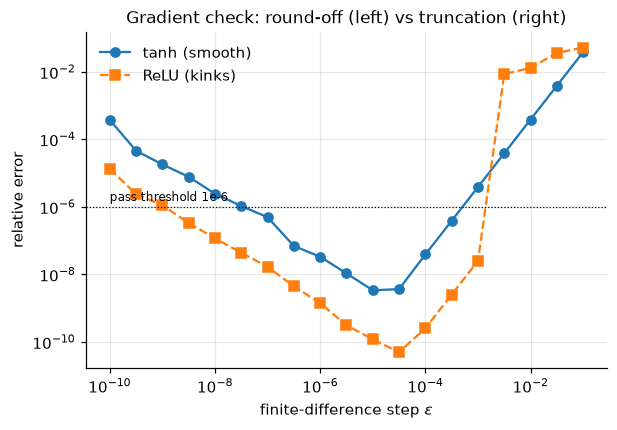</p>

The V-shape is the textbook picture: round-off error on the left, truncation error on the right.
The ReLU curve jumps once $\epsilon$ is large enough for a perturbation to cross a kink
($z=0$), where the finite difference no longer measures the derivative.

<!-- results:02 -->
| network 2-8-8-3 | max rel. error, parameters | max rel. error, inputs | < 1e-6 ? |
|---|---|---|---|
| tanh | 3.4e-08 | 1.3e-09 | PASS |
| relu | 1.4e-09 | 5.7e-10 | PASS |
| sigmoid | 1.9e-08 | 2.2e-08 | PASS |
| tanh + batchnorm + dropout | 2.9e-09 | 8.6e-10 | PASS |

| model (spirals, 3 classes) | test accuracy |
|---|---|
| majority class | 33.3% |
| softmax regression (no hidden layer) | 33.0% |
| MLP 2-64-64-3, ReLU, Adam | 100.0% |
| XOR with 4 hidden tanh units (train) | 93.2% |
<!-- /results:02 -->

<p align="center">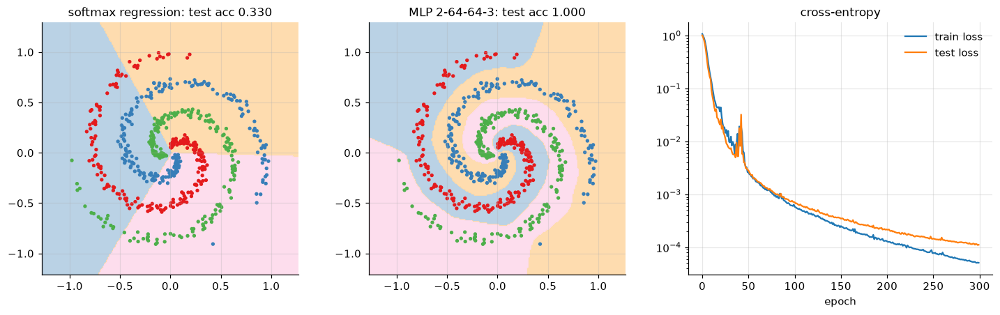</p>

---

## Lesson 03 - Training craft

📄 [`lessons/03_training_craft/lesson.py`](lessons/03_training_craft/lesson.py) · 📓 [`notebooks/03_training_craft.ipynb`](notebooks/03_training_craft.ipynb)

### 1. Initialisation and signal propagation

For $z=\sum_{i=1}^{n}w_i h_i$ with independent zero-mean weights,
$\operatorname{Var}z = n\,\operatorname{Var}w\;\mathbb E[h^2]$. To keep the scale constant from
layer to layer, we need

* **Xavier/LeCun** (tanh, which is roughly linear near 0): $\operatorname{Var}w = 1/n$,
* **He/Kaiming** (ReLU, which zeroes half its inputs, so $\mathbb E[h^2]=\tfrac12\operatorname{Var}z$): $\operatorname{Var}w = 2/n$.

With weights of size 0.01 the activations shrink by about $0.01\sqrt{256}\approx0.16$ per layer
and vanish. The gradients are then about $10^{-7}$, so nothing learns. With ReLU + Xavier the signal
decays slowly; with ReLU + He it stays at order 1.

<p align="center">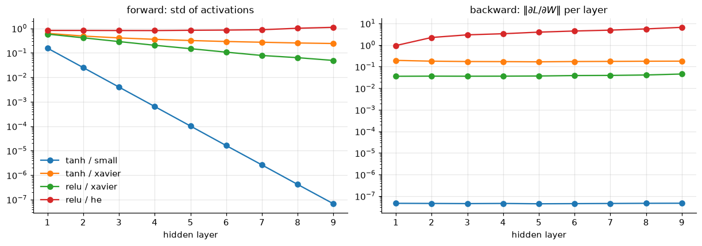</p>

### 2. Activations

Since $\sigma'(z)\le 1/4$, every sigmoid layer multiplies the backward signal by at most 1/4.
Six layers therefore attenuate it by up to $4^{-6}\approx 2\times10^{-4}$. tanh ($\tanh'(0)=1$) and
ReLU ($\text{ReLU}'=1$ where active) do not have this problem.

<p align="center">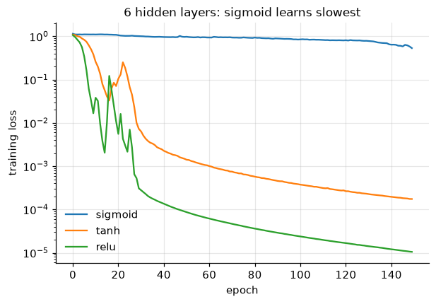</p>

### 3. Optimisers

| method | update |
|---|---|
| SGD | $\theta\leftarrow\theta-\eta g$ |
| momentum | $v\leftarrow\mu v-\eta g,\;\theta\leftarrow\theta+v$ (a heavy ball: it accumulates speed along consistent directions and damps oscillations across a valley) |
| Adam | $m\leftarrow\beta_1m+(1-\beta_1)g,\;s\leftarrow\beta_2s+(1-\beta_2)g^2,\;\theta\leftarrow\theta-\eta\,\hat m/(\sqrt{\hat s}+\epsilon)$ with bias corrections $\hat m=m/(1-\beta_1^t)$, $\hat s=s/(1-\beta_2^t)$ |

The Rosenbrock function $f=(1-x)^2+100(y-x^2)^2$ is a curved, narrow valley. Plain GD needs a tiny
step to stay stable across the valley, so it crawls along it. Adam divides each coordinate's step
by its own gradient scale and reaches the minimum.

<p align="center">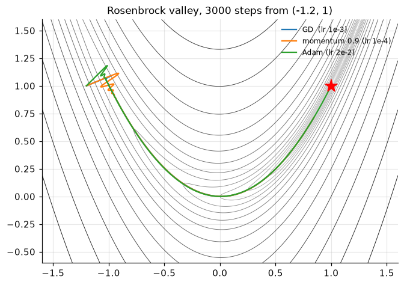 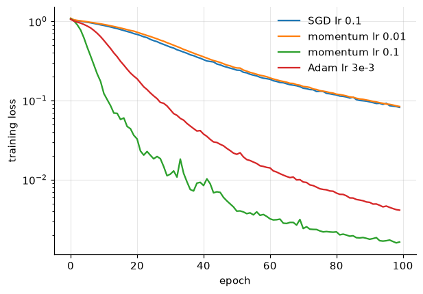</p>

### 4. Learning-rate schedules

Step decay (÷10 at 50 % and 75 % of training), cosine decay
$\eta_t=\tfrac12\eta_0(1+\cos\pi t/T)$, and linear warm-up. On this small problem all schedules
end within a fraction of a percent of each other. That is an honest negative result: schedules
matter most for large models and long training runs.

<p align="center">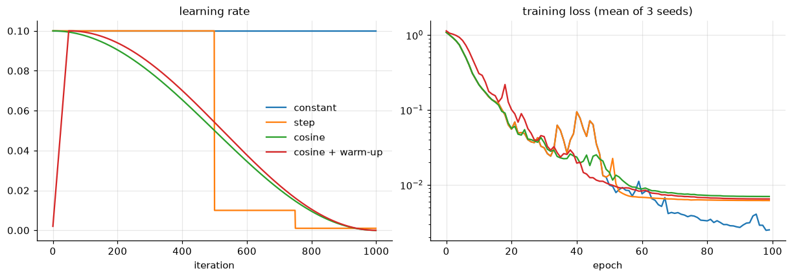</p>

### 5. Batch normalisation

BN re-centres and re-scales each feature using batch statistics. This keeps the pre-activations
in the useful, non-saturated range of the sigmoid, whatever the previous layers do. At test time
it uses running averages. A 10-layer sigmoid network does not train at all without BN; with BN,
it does.

<p align="center">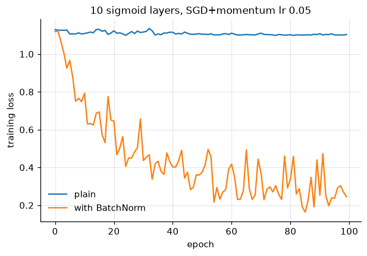</p>

### 6. Overfitting, regularisation, early stopping

150 training points with **20 % flipped labels** and a network with 67 000 parameters. Without
regularisation the network memorises the noise: training accuracy approaches 100 % while the
validation loss climbs. The remedies:

* **weight decay**, $L+\frac\lambda2\lVert W\rVert^2$, which prefers small weights and therefore
  smooth functions;
* **dropout**, which trains an ensemble of thinned networks;
* **early stopping** at the minimum of the validation loss.

Note that the "training loss" plotted with weight decay includes the penalty term.

<p align="center">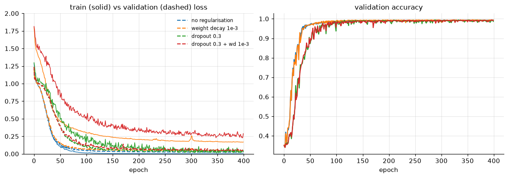</p>

**Results:**

<!-- results:03 -->
**Activations** (6 hidden layers, Adam 3e-3, 150 epochs)

| activation | final train loss | train accuracy |
|---|---|---|
| sigmoid | 5.34e-01 | 79.8% |
| tanh | 1.75e-04 | 100.0% |
| relu | 1.05e-05 | 100.0% |

**Optimisers**

| run | final value |
|---|---|
| Rosenbrock, GD  (lr 1e-3) | 2.5e-02 |
| Rosenbrock, momentum 0.9 (lr 1e-4) | 2.4e-02 |
| Rosenbrock, Adam (lr 2e-2) | 2.8e-07 |
| spiral MLP loss, SGD lr 0.1 | 0.0822 |
| spiral MLP loss, momentum lr 0.01 | 0.0842 |
| spiral MLP loss, momentum lr 0.1 | 0.0016 |
| spiral MLP loss, Adam lr 3e-3 | 0.0041 |

**LR schedules** (SGD + momentum, 100 epochs, mean of 3 seeds)

| schedule | final train loss | test accuracy |
|---|---|---|
| constant | 0.0025 | 99.7% |
| step | 0.0062 | 99.6% |
| cosine | 0.0070 | 99.6% |
| cosine + warm-up | 0.0065 | 99.6% |

**Batch norm** (10 sigmoid hidden layers, SGD + momentum)

| network | final train loss | train accuracy |
|---|---|---|
| plain | 1.104 | 33.3% |
| with BatchNorm | 0.246 | 86.3% |

**Overfitting** (150 points, 20 % label noise, 2-256-256-3, 400 epochs)

| regularisation | train acc | val acc (final) | val loss (final) | early stopping: epoch / val acc |
|---|---|---|---|---|
| no regularisation | 99.3% | 76.0% | 1.165 | 58 / 83.5% |
| weight decay 1e-3 | 94.0% | 79.7% | 0.542 | 122 / 83.2% |
| dropout 0.3 | 95.3% | 79.5% | 0.605 | 197 / 85.9% |
| dropout 0.3 + wd 1e-3 | 91.3% | 81.9% | 0.452 | 199 / 89.2% |
<!-- /results:03 -->

---

## Lesson 04 - PyTorch basics

📄 [`lessons/04_pytorch_basics/lesson.py`](lessons/04_pytorch_basics/lesson.py) · 📓 [`notebooks/04_pytorch_basics.ipynb`](notebooks/04_pytorch_basics.ipynb) · code: [`nnaz/torch_basics.py`](nnaz/torch_basics.py)

### Autograd = backprop that writes itself

Every operation on a tensor with `requires_grad=True` records a node in a **computational
graph**: `f.grad_fn` points to `AddBackward0`, which points to `MulBackward0` and `SinBackward0`,
and so on. `f.backward()` walks the graph from the output back to the leaves. At each node it
multiplies the incoming gradient by that operation's local Jacobian. This is exactly what our
`Layer.backward` methods did by hand in lesson 02, done automatically for any composition of
operations. This is *reverse-mode* automatic differentiation: one backward sweep gives the
gradient with respect to **all** inputs, which is ideal for one scalar loss and millions of
parameters. It is not finite differences, so the derivatives are exact up to round-off.

Because the backward pass is itself built from differentiable operations, we can differentiate
again. `torch.autograd.grad(..., create_graph=True)` gives second and third derivatives. PINNs
(lesson 09) and Hamiltonian networks (lesson 15) rely on this.

A **custom operation** subclasses `torch.autograd.Function` and implements both `forward` and
`backward`. Here `softplus(x) = log(1 + e^x)` with derivative `sigmoid(x)`. It is verified with
`torch.autograd.gradcheck`, PyTorch's built-in version of our lesson-02 gradient check.

<p align="center"></p>

### The canonical training loop

```python
for epoch in range(epochs):
    model.train()                       # dropout / batch-norm in training mode
    for xb, yb in loader:               # DataLoader shuffles and batches
        opt.zero_grad()                 # gradients ACCUMULATE by default
        loss = loss_fn(model(xb), yb)   # forward: builds the graph
        loss.backward()                 # backward: fills p.grad for every parameter
        opt.step()                      # update using p.grad
    model.eval()
    with torch.no_grad(): ...           # evaluation: no graph, less memory
```

### Same numbers as our NumPy code

We copy the weights of the lesson-02 NumPy MLP into an `nn.Module`. `nn.Linear` stores $W^\top$,
so the weights are transposed. We then run full-batch gradient descent in **both** libraries in
float64. At lr = 0.1 the two loss curves agree to round-off ($10^{-16}$) for 300 steps. At
lr = 0.5 they agree until about step 160, then diverge to $O(1)$ differences. Neither library
is wrong: at that learning rate gradient descent becomes unstable (see the loss spike). The
dynamics turn chaotic and amplify the $10^{-16}$ difference in summation order, just as a
turbulent flow amplifies round-off. This is a useful reminder that bit-for-bit reproducibility
across libraries is only possible in a stable regime.

<p align="center"></p>

<!-- results:04 -->
| check | value |
|---|---|
| autograd vs hand derivative of x²y + sin(xy) | 0.0e+00 |
| custom `MySoftplus` passes `torch.autograd.gradcheck` | True |
| nested autograd: tanh' and tanh'' vs exact formulas | 2.7e-16, 5.4e-16 |
| NumPy vs PyTorch gradients at step 0 (float64) | 1.6e-16 |
| max loss difference over 300 GD steps, lr 0.1 (stable) | 4.4e-16 |
| max loss difference over 300 GD steps, lr 0.5 (unstable, chaotic) | 1.3e+00 |
| PyTorch MLP on spirals: test accuracy | 99.7% |
<!-- /results:04 -->

---

## Lesson 05 - Convolutional networks on MNIST and Fashion-MNIST

📄 [`lessons/05_cnn_mnist/lesson.py`](lessons/05_cnn_mnist/lesson.py) · 📓 [`notebooks/05_cnn_mnist.ipynb`](notebooks/05_cnn_mnist.ipynb) · code: [`nnaz/cnn.py`](nnaz/cnn.py)

### The convolution

A convolution layer slides a small kernel $K$ over the image. With $C_\text{in}$ input channels:

$$ Y[o,i,j] = b_o + \sum_{c=1}^{C_\text{in}}\sum_{u,v=0}^{k-1} K[o,c,u,v]\;X[c,\,i+u,\,j+v]. $$

(Deep-learning libraries compute a cross-correlation and call it a convolution.) Compared with
a dense layer it builds in two assumptions that suit images and fields:

* **locality**: an output pixel depends only on a $k\times k$ neighbourhood, like a finite-difference stencil;
* **weight sharing**: the same kernel is applied everywhere, so a detector learnt in one place
  works everywhere (translation **equivariance**), and the parameter count does not depend on
  the image size.

A hand-made **Sobel** kernel is a vertical-edge detector, and in fact a central-difference
approximation of $\partial/\partial x$ smoothed in $y$. A CNN *learns* such stencils. The lesson
computes the same convolution three ways: explicit loops, **im2col** (every patch unrolled into a
column, so the convolution becomes one big matrix product, which is how libraries do it), and
`torch.nn.functional.conv2d`. All three agree to round-off.

<p align="center">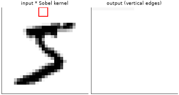</p>

### Architecture and shapes

```
input 1x28x28 → conv5x5 (16) → ReLU → 16x24x24 → maxpool2 → 16x12x12
              → conv5x5 (32) → ReLU → 32x8x8   → maxpool2 → 32x4x4 → flatten 512
              → Linear 128 → ReLU → dropout 0.3 → Linear 10 (logits)
```

Output size of a "valid" convolution is $n-k+1$; of a $2\times2$ max-pool, $n/2$. **Max-pooling**
adds a little translation *invariance* and halves the resolution, so deeper layers "see" larger
regions: the **receptive field** grows from 5×5 to 16×16 pixels after the second conv/pool pair.

### Results

The comparison uses models with the **same parameter budget** (MLP 76 k vs CNN 80 k), trained
with Adam (lr 1e-3, batch 128) for 5 epochs:

<!-- results:05 -->
| data set | model | parameters | test accuracy | CPU training time |
|---|---|---|---|---|
| MNIST | majority class | - | 11.3% | - |
| MNIST | logistic regression | 7850 | 92.4% | 2 s |
| MNIST | MLP 784-96-10 | 76330 | 97.7% | 3 s |
| MNIST | CNN | 80202 | 99.2% | 34 s |
| FashionMNIST | majority class | - | 10.0% | - |
| FashionMNIST | logistic regression | 7850 | 84.1% | 2 s |
| FashionMNIST | MLP 784-96-10 | 76330 | 87.6% | 4 s |
| FashionMNIST | CNN | 80202 | 89.6% | 765 s |

Convolution implementations agree: loops vs `F.conv2d` 1.4e-14, im2col vs `F.conv2d` 0.0e+00.
<!-- /results:05 -->

<p align="center">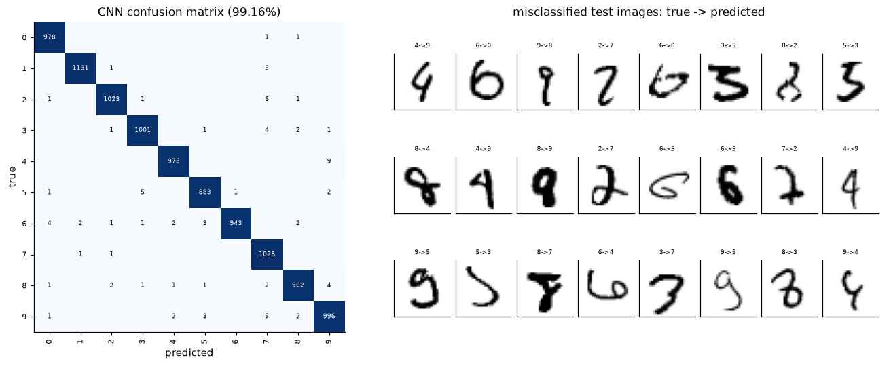</p>

The learnt first-layer filters are oriented edge and stroke detectors. The feature maps show
which parts of the digit each filter responds to. The second-layer maps are coarser and more
abstract: corners, stroke ends, curvature.

<p align="center">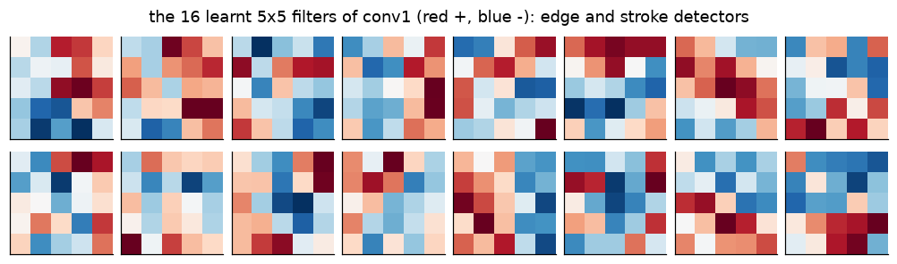<br>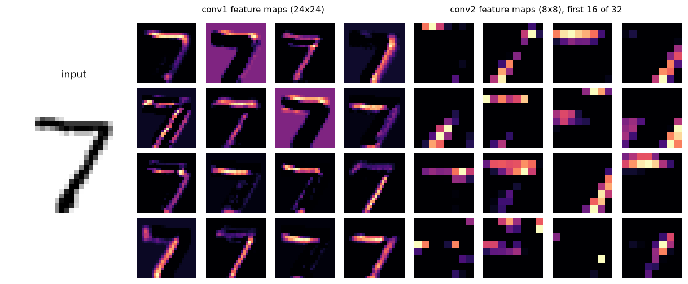</p>

**Fashion-MNIST** is much harder: shirt, T-shirt, pullover and coat look alike at 28×28 (see its
confusion matrix). The CNN's advantage over the MLP is smaller there, and about 90 % is typical
for a small network and a few epochs.

<p align="center">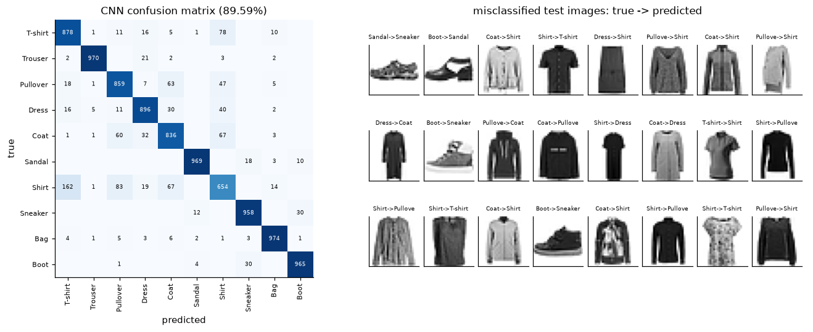</p>

---

## Lesson 06 - RNN and LSTM forecasting of a nonlinear oscillator

📄 [`lessons/06_rnn_lstm/lesson.py`](lessons/06_rnn_lstm/lesson.py) · 📓 [`notebooks/06_rnn_lstm.ipynb`](notebooks/06_rnn_lstm.ipynb) · code: [`nnaz/rnn.py`](nnaz/rnn.py)

### Data: the Van der Pol oscillator

$$ \ddot x-\mu(1-x^2)\dot x+x=0,\qquad \mu=2 . $$

The nonlinear damping pumps energy in for $|x|<1$ and removes it for $|x|>1$. Every trajectory
therefore converges to a **limit cycle** of period about 7.6, with slow phases and fast jumps
(relaxation oscillations). We integrate it with SciPy's RK45 at tight tolerances
(`rtol = atol = 1e-10`), sample every $\Delta t = 0.1$, and add Gaussian observation noise
with $\sigma = 0.1$.

<p align="center">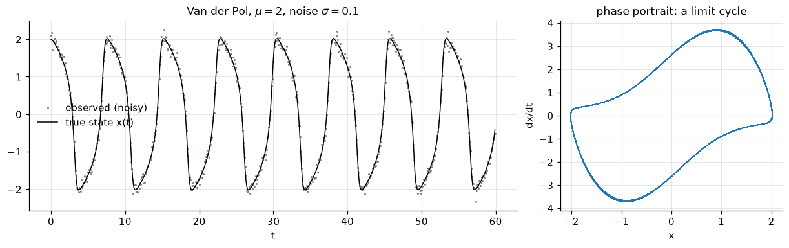</p>

### Recurrent networks

A vanilla RNN reads the window one value at a time and updates a hidden state,
$h_t=\tanh(W_xx_t+W_hh_{t-1}+b)$. Backpropagation *through time* multiplies $T$ Jacobians
$\partial h_t/\partial h_{t-1}$. The product vanishes or explodes geometrically, which is the
same mechanism as the deep sigmoid network of lesson 03, only now along time.
The **LSTM** fixes this with a separate cell state that is updated *additively* and controlled
by gates:

$$
\begin{aligned}
f_t&=\sigma(W_f[h_{t-1},x_t]+b_f), & i_t&=\sigma(W_i[h_{t-1},x_t]+b_i), & o_t&=\sigma(W_o[h_{t-1},x_t]+b_o),\\
g_t&=\tanh(W_g[h_{t-1},x_t]+b_g), & c_t&=f_t\odot c_{t-1}+i_t\odot g_t, & h_t&=o_t\odot\tanh(c_t).
\end{aligned}
$$

When the forget gate $f_t\approx1$, the gradient flows through $c_t$ almost unchanged: a
"gradient highway". Our models read a window of $p = 40$ noisy samples and predict the
**increment** $x_{t+1}-x_t$ from the last hidden state (a residual formulation). They are trained
with Adam, a cosine learning-rate schedule and gradient-norm clipping at 1.0, which guards
against exploding gradients.

### Baselines

* **persistence**: $\hat x_{t+1}=x_t$;
* **linear AR($p$)**: $\hat x_{t+1}=a\cdot(x_{t-p+1},\dots,x_t)+c$, solved *exactly* by least
  squares. This is the optimal *linear* one-step predictor and a classical, strong baseline.

### One-step vs closed-loop forecasting

A **one-step** forecast always sees real observations. A **closed-loop** (autoregressive)
forecast feeds each prediction back in as the next input. Errors then compound, and the model
must have learnt the *dynamics*, not just local smoothing.

<p align="center">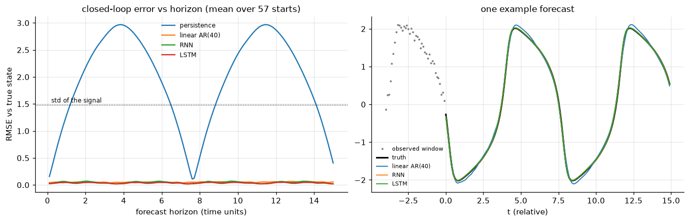<br>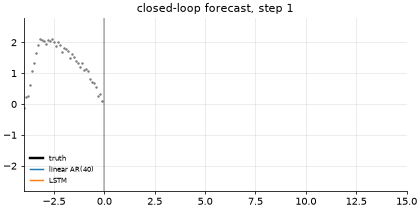</p>

<!-- results:06 -->
| model | 1-step RMSE vs noisy obs. | 1-step RMSE vs true state | closed loop, 10 steps | 50 steps | 150 steps |
|---|---|---|---|---|---|
| persistence | 0.2023 | 0.1755 | 1.292 | 2.585 | 0.406 |
| linear AR(40) | 0.1076 | 0.0457 | 0.047 | 0.053 | 0.056 |
| RNN | 0.1037 | 0.0331 | 0.060 | 0.048 | 0.022 |
| LSTM | 0.1025 | 0.0300 | 0.047 | 0.038 | 0.020 |

The noise floor is 0.100: even a perfect model scores 0.100 against the noisy observations.
<!-- /results:06 -->

**Honest reading of the numbers.** On noisy observations, all learnt models are close to the
noise floor (0.100), so the fair comparison is against the **true state**. There the LSTM is
the most accurate, both one step ahead and in closed loop. It keeps the phase and the sharp
jumps of the limit cycle for two full periods. The linear AR model is a *much* stronger
baseline than people expect: a periodic signal is a sum of harmonics, and any sum of $m$
sinusoids obeys an exact linear recurrence of order $2m$. A 40-tap linear filter captures most
of it, so the LSTM's advantage is real but modest (1.4-3× lower closed-loop error depending on the
horizon). With a shorter window, or on a less regular (e.g. chaotic) signal, the gap would be larger.

---

## Lesson 07 - Autoencoders: compression, denoising, and PCA/SVD

📄 [`lessons/07_autoencoders/lesson.py`](lessons/07_autoencoders/lesson.py) · 📓 [`notebooks/07_autoencoders.ipynb`](notebooks/07_autoencoders.ipynb) · code: [`nnaz/autoencoder.py`](nnaz/autoencoder.py)

### The idea

An autoencoder is an encoder $e:\mathbb R^D\to\mathbb R^k$ and a decoder $d:\mathbb R^k\to\mathbb R^D$,
trained to reproduce its input through a **bottleneck** $k\ll D$:

$$\min_{e,d}\ \frac1N\sum_n\lVert x_n-d(e(x_n))\rVert^2 .$$

The network cannot copy the input, so it must find a compact **code** that captures the
structure of the data. In engineering this is **model-order reduction**: the same idea compresses
CFD snapshots in lesson 16.

### A linear autoencoder *is* PCA, and we can check it exactly

Centre the data, $X-\bar x=U\Sigma V^\top$ (SVD). By the **Eckart-Young theorem**, the best
rank-$k$ approximation in the least-squares sense is the projection onto the first $k$ right
singular vectors, with error $\sum_{i>k}\sigma_i^2/N$. A linear autoencoder
$x\mapsto W_dW_ex$ is a rank-$k$ map, so it cannot beat this. Baldi and Hornik (1989) showed that
all its minima span **the same subspace** as $V_k$. But $W_d$ need not be orthonormal, so the
individual latent coordinates are an arbitrary invertible mixture of the principal components.
We measure both claims: the training MSE against the exact optimum, and the principal angles
between the column space of $W_d$ and $\operatorname{span}(V_k)$.

<p align="center"></p>

### Non-linear and convolutional autoencoders

* **MLP autoencoder**: 784-256-$k$-256-784, ReLU, sigmoid output.
* **Convolutional autoencoder**: strided 3×3 convolutions downsample 28→14→7, a linear layer maps
  to the $k$-dimensional code, and **transposed convolutions** (learnable up-sampling) map back
  7→14→28. It has fewer parameters because of weight sharing (lesson 05).

<p align="center"><br></p>

<!-- results:07 -->
| k | PCA optimum (train) | linear AE (train) | gap | max principal angle | PCA (test) | MLP AE (test) | conv AE (test) |
|---|---|---|---|---|---|---|---|
| 2 | 0.05595 | 0.05605 | 0.2% | 15.1° | 0.05379 | 0.04251 | 0.05037 |
| 4 | 0.04818 | 0.04831 | 0.3% | 32.0° | 0.04683 | 0.03121 | 0.03889 |
| 8 | 0.03787 | 0.03790 | 0.1% | 10.5° | 0.03727 | 0.02003 | 0.02479 |
| 16 | 0.02729 | 0.02736 | 0.2% | 5.4° | 0.02725 | 0.01210 | 0.01564 |
| 32 | 0.01724 | 0.01735 | 0.6% | 9.0° | 0.01734 | 0.00716 | 0.00821 |

| denoiser (σ = 0.5) | PSNR |
|---|---|
| noisy input | 9.37 dB |
| PCA projection (best k = 64) | 15.09 dB |
| convolutional denoising autoencoder | 9.89 dB |

| 2-D code | 5-NN digit accuracy |
|---|---|
| PCA | 41.2% |
| MLP autoencoder | 58.2% |
<!-- /results:07 -->

*Note: the denoising row above still comes from the first (non-residual) denoiser, which barely beat the noisy input; the residual version described below is regenerated in the next full run.*

**Reading the table.**
* The linear AE reaches the Eckart-Young optimum to within 0.1-0.6 %, as theory says.
* The principal angles are small, but not zero, and they are **largest for $k=4$**. When two
  singular values are close ($\sigma_4\approx\sigma_5$), the optimal subspace is ill-conditioned:
  rotating inside the near-degenerate pair costs almost no loss. The angle error scales like
  (loss gap)/(eigenvalue gap). This is a general lesson for POD/PCA with clustered spectra.
* Non-linear autoencoders beat PCA at every $k$. At $k=16$ the MLP AE halves the error, because
  the digit manifold is curved and a linear subspace wastes dimensions.
* The convolutional AE is trained for **one third of the epochs** (it costs about 5× more per
  epoch on a CPU), so it is *not* a fair loss comparison. We report it as run.
* In 2-D the non-linear code separates the digit classes much better than the PCA plane
  (5-NN accuracy in the table).

<p align="center"></p>

### Denoising

Train with **corrupted inputs and clean targets**, $\min\lVert x-f(x+\eta)\rVert^2$ with
$\eta\sim\mathcal N(0,0.5^2)$. The network must learn what digits look like in order to remove
what does not belong. The baseline is **projection onto the top-$k$ principal components**,
which is classical linear denoising (we report the best $k$). Our denoiser is a small fully
convolutional network with **residual learning** (Zhang et al. 2017): it predicts the correction
$f(\tilde x)$ and outputs $\tilde x+f(\tilde x)$, starting from the identity map.

<p align="center"></p>

---

## Lesson 08 - Attention from scratch, then a tiny GPT

📄 [`lessons/08_attention_gpt/lesson.py`](lessons/08_attention_gpt/lesson.py) · 📓 [`notebooks/08_attention_gpt.ipynb`](notebooks/08_attention_gpt.ipynb) · code: [`nnaz/attention.py`](nnaz/attention.py)

### Attention is a soft lookup table

Each position $i$ emits a **query** $q_i$, a **key** $k_i$ and a **value** $v_i$, which are
linear projections of its embedding. Position $i$ reads a weighted average of all values,
weighted by how well its query matches each key:

$$
\operatorname{Attention}(Q,K,V)=\operatorname{softmax}\!\Big(rac{QK^	op}{\sqrt{d_k}}+M\Big)V,
\qquad M_{ij}=egin{cases}0 & j\le i\ -\infty & j>i\end{cases}
$$

* The **causal mask** $M$ stops a position from looking at the future. This is what makes
  next-token prediction a fair game.
* **Why $1/\sqrt{d_k}$?** For random unit-variance $q,k$, the dot product $q\cdot k$ has
  variance $d_k$. Without scaling, the logits grow with the head size and the softmax saturates
  to one-hot, which also kills its gradient. The right panel below measures this.
* **Multi-head**: $h$ attention maps run in parallel on $d/h$-dimensional slices, so different
  heads can track different relations (the previous character, the start of the word, the
  speaker's name, ...).
* Attention alone is **permutation-equivariant**: it does not know the order of its inputs.
  Order enters through **positional embeddings** added to the token embeddings.

<p align="center">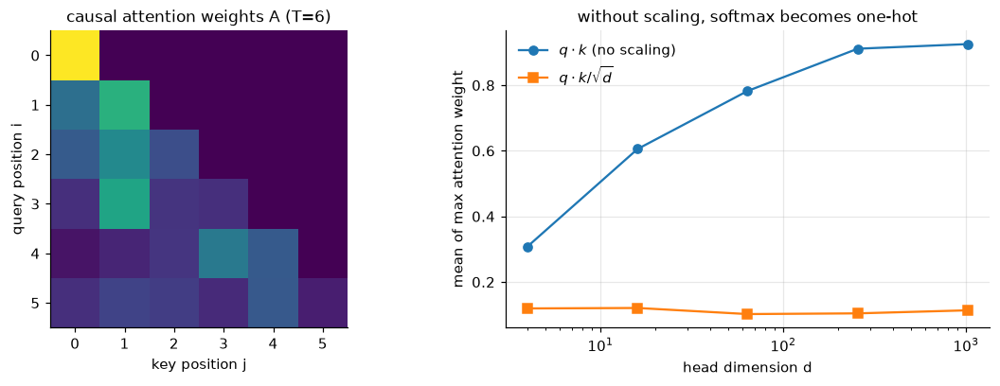</p>

### The GPT block

```
x = token_embedding[idx] + position_embedding[0..T-1]
repeat n_layer times:
    x = x + MultiHeadCausalAttention(LayerNorm(x))   # positions exchange information
    x = x + MLP(LayerNorm(x))                        # per-position computation, 4x wider, GELU
logits = LayerNorm(x) @ token_embedding^T            # weight tying
loss = cross_entropy(logits[t], idx[t+1])            # predict the NEXT character
```

The residual connections $x+f(x)$ give the gradient a direct path through the whole stack,
just like the LSTM cell state does through time. Generation is **autoregressive**: predict a
distribution over the next character, sample from it (temperature 0.8), append, repeat.

Our model has 4 layers, 4 heads, width 128 and a context of 64 characters (0.81 M parameters).
It is trained with AdamW, warm-up and cosine decay for 3000 steps of 32×64 characters, about
5 minutes on a CPU.

<!-- results:08 -->
| model | validation cross-entropy (nats/char) |
|---|---|
| uniform over the 65 characters | 4.174 |
| unigram (character frequencies) | 3.347 |
| bigram (add-one smoothing) | 2.482 |
| TinyGPT, 0.81 M params, 3000 steps (5.4 min CPU) | **1.605** (train 1.404) |

From-scratch attention vs PyTorch: 1.1e-16 (NumPy, float64), 8.9e-08 (multi-head module, float32).
<!-- /results:08 -->

<p align="center">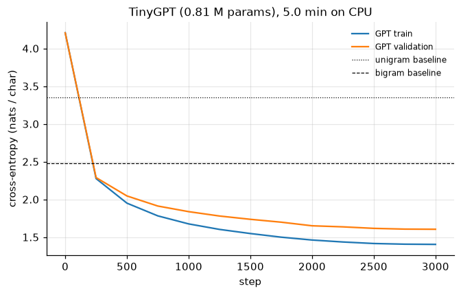 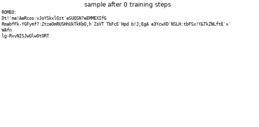</p>

Validation cross-entropy of 1.6 nats/char means the model is on average as uncertain as a choice
among $e^{1.6}pprox5$ characters, against 12 for the bigram model. The samples have the
*form* of a play: speaker names in capitals, line breaks, archaic words. The sense is poor,
which is expected at 0.8 M parameters and 5 CPU-minutes. The training/validation gap
(1.40 vs 1.61) shows the beginning of overfitting on a 1 MB corpus.
A sample ([`docs/lesson08/sample.txt`](docs/lesson08/sample.txt)):

```
ROMEO:
My lord, sir, as I would now you, that noble counter
I take her lamp of quit of the man's plant heart,
...
KING RICHARD III:
O, the should of you have flower cares to no be; though we
```

Attention maps of the trained network show distinct heads. Some attend to the immediately
preceding characters, like an n-gram model. Others attend to earlier positions such as the
start of the current word or the previous line.

<p align="center">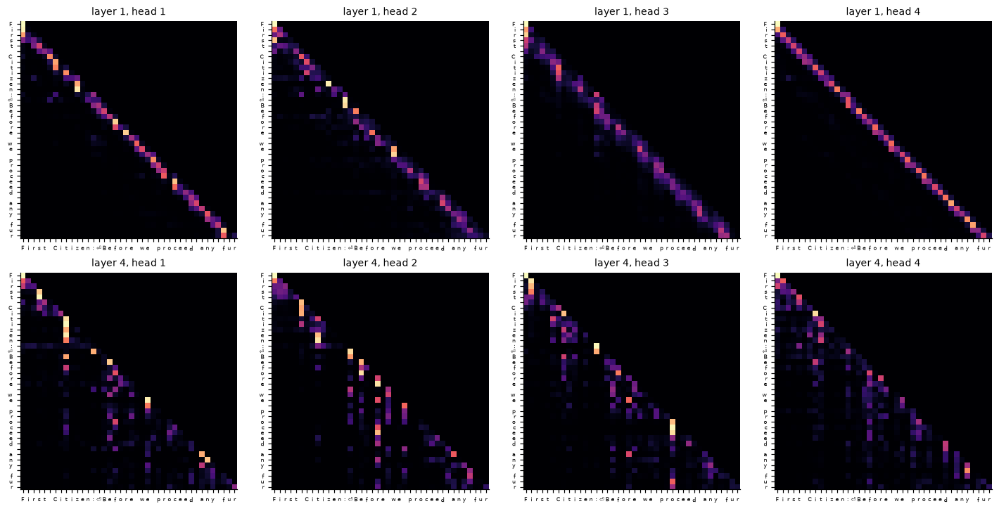</p>

---

## Lesson 09 - Scientific ML: a PINN for Burgers and a neural surrogate of a solver

📄 [`lessons/09_scientific_ml/lesson.py`](lessons/09_scientific_ml/lesson.py) · 📓 [`notebooks/09_scientific_ml.ipynb`](notebooks/09_scientific_ml.ipynb) · code: [`nnaz/burgers.py`](nnaz/burgers.py), [`nnaz/pinn.py`](nnaz/pinn.py)

### The benchmark problem

$$ u_t+u\,u_x=\nu\,u_{xx},\qquad x\in[-1,1],\ t\in[0,1],\qquad u(x,0)=-\sin\pi x,\quad u(\pm1,t)=0,\quad \nu=\tfrac{0.01}{\pi}. $$

The two halves of the sine wave run into each other at $x=0$ and form a viscous shock whose
thickness is only about $\nu/|u|\approx0.003$ by $t\approx0.4$. This is the standard PINN
benchmark (Raissi, Perdikaris and Karniadakis 2019).

### Exact solution (Cole-Hopf) - our ground truth

The **Cole-Hopf** transform $u=-2\nu\,\phi_x/\phi$ turns Burgers into the heat equation
$\phi_t=\nu\phi_{xx}$. For this initial condition the solution is

$$
u(x,t)=-\frac{\displaystyle\int\sin\pi(x-\eta)\,f(x-\eta)\,e^{-\eta^2/4\nu t}\,d\eta}{\displaystyle\int f(x-\eta)\,e^{-\eta^2/4\nu t}\,d\eta},
\qquad f(y)=\exp\!\Big(-\frac{\cos\pi y}{2\pi\nu}\Big).
$$

We substitute $\eta=\sqrt{4\nu t}\,z$ and evaluate both integrals with **Gauss-Hermite
quadrature** (weight $e^{-z^2}$). $f$ reaches $e^{50}$, so we work with $\log f$ and subtract its
maximum before exponentiating. Using 120 or 200 nodes changes the answer by less than $10^{-15}$.

### A classical solver, validated

Second-order central finite differences in conservative form,
$\partial_t u_j=-\frac{F_{j+1}-F_{j-1}}{2\Delta x}+\nu\frac{u_{j+1}-2u_j+u_{j-1}}{\Delta x^2}$
with $F=u^2/2$, and classical RK4 in time. The Dirichlet problem equals the periodic one here,
because $-\sin\pi x$ is odd and 2-periodic. Central differencing of convection is
non-oscillatory only when the **cell Reynolds number** $|u|\Delta x/\nu<2$, which is the classic
CFD constraint. The time step respects both the diffusive limit ($\propto\Delta x^2/\nu$) and the
convective CFL limit. The convergence table below shows the cell-Reynolds constraint at work:
at N = 128 and 256 the cell Reynolds number is 4.9 and 2.5, the scheme wiggles, and the error
barely improves. From N = 512 on it converges at the design order of 2.

### The PINN

A network $u_\theta(x,t)$ is trained to make the **PDE residual** vanish at 7 500
collocation points. No solution data is used:

$$
\mathcal L(\theta)=\frac1{N_c}\sum_{i}\big(\partial_tu_\theta+u_\theta\,\partial_xu_\theta-\nu\,\partial_{xx}u_\theta\big)^2\Big|_{(x_i,t_i)} .
$$

All derivatives are **exact** derivatives of the network, computed by autograd
(`create_graph=True` twice for $u_{xx}$). Design choices, each a common PINN "trick":

* **Hard constraints**: $u_\theta=-\sin\pi x+t(1-x^2)N_\theta(x,t)$ satisfies the initial and
  boundary conditions for *any* $\theta$. There are no competing loss terms to weight.
* **float64**: second derivatives of a deep tanh network are sensitive to round-off.
* **Adam, then L-BFGS**: Adam is robust far from a solution (it stalls at about 10-20 % error
  here). L-BFGS, a quasi-Newton method, converges much faster near one; the error drops by two
  orders of magnitude.
* extra collocation points near $x=0$, where the steep front forms.

<p align="center">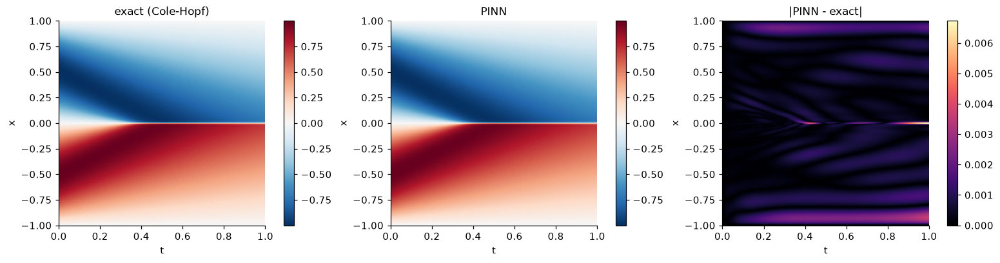<br>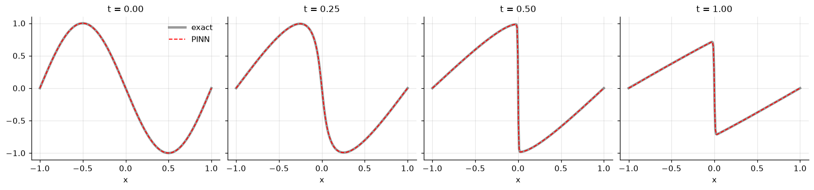<br>
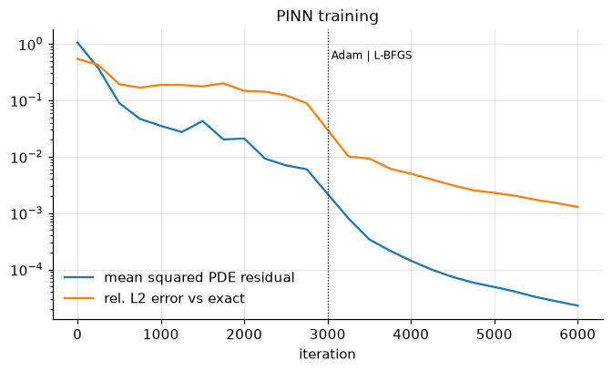 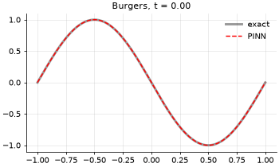</p>

### A neural surrogate of the solver

A **surrogate** replaces an expensive simulation with a cheap learnt map, here
$(\nu, A)\mapsto u(x, T=0.5)$ for $u(x,0)=-A\sin\pi x$, with $\nu\in[0.005,0.05]$ (log-uniform)
and $A\in[0.5,1.5]$. We run the FD solver 400 times (vectorised: all parameters are advanced
together) and fit an MLP that outputs the 128-point solution. It is tested on 200 new
parameter pairs.

<p align="center">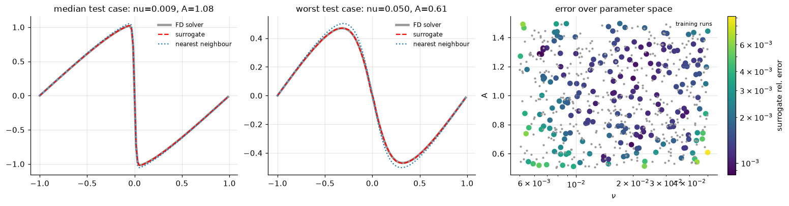</p>

<!-- results:09 -->
**Reference solver**

| FD grid N | rel. L2 error at t = 1 vs Cole-Hopf | CPU time |
|---|---|---|
| 128 | 5.2e-03 | 0.03 s |
| 256 | 4.8e-03 | 0.06 s |
| 512 | 1.3e-03 | 0.13 s |
| 1024 | 3.2e-04 | 0.46 s |
| 2048 | 8.1e-05 | 2.24 s |

Observed order of accuracy: **1.97** (second-order scheme).

**PINN** (ν = 0.01/π)

| quantity | value |
|---|---|
| PINN rel. L2 error, whole space-time grid | **1.3e-03** |
| PINN max abs error | 6.7e-03 |
| PINN rel. L2 error at t = 0.25 / 0.5 / 0.75 / 1 | 9.9e-04 / 1.2e-03 / 1.6e-03 / 2.9e-03 |
| PINN parameters / training time (CPU) | 5409 / 15.8 min |
| Raissi et al. (2019), 9x20 net, 10 000 points (published) | 6.7e-04 |

**Surrogate**

| model (test set, rel. L2 error) | median | 95th percentile |
|---|---|---|
| mean solution (trivial baseline) | 2.1e-01 | - |
| nearest training run | 1.3e-02 | 4.9e-02 |
| piecewise-linear interpolation (Delaunay in parameter space) | 7.2e-04 | 2.2e-03 |
| neural surrogate (MLP 2 -> 128 grid values) | 1.5e-03 | 4.5e-03 |

Solver: 111 ms per solution (vectorised over parameters); its own error at the parameter-space corners is 1.6e-03. Surrogate: 4.2 µs per solution after 19 s of training on 400 solver runs.
<!-- /results:09 -->

**Honest reading.**
* The PINN reaches about $10^{-3}$ relative error without seeing any solution data, the same
  order as the published result. It costs **minutes** of CPU time. The finite-difference solver
  reaches $3\times10^{-4}$ in **half a second** (N = 1024). For a single forward problem like this
  one, a classical solver wins by orders of magnitude. PINNs earn their keep for inverse problems
  (unknown $\nu$ or unknown sources from sparse data), for irregular data assimilation, or when a
  mesh is inconvenient.
* On a 2-parameter problem with 400 runs, **piecewise-linear interpolation beats the neural
  surrogate**, and both are below the solver's own discretisation error (about $10^{-3}$).
  Neural surrogates pay off when the parameter space has many dimensions (interpolation tables
  scale exponentially) or when the output is a large field. The lesson that transfers: always
  benchmark a surrogate against simple interpolation and nearest-neighbour baselines.
* A surrogate evaluation costs microseconds against about 100 ms for a solve. That is the
  real value in design loops, uncertainty quantification and optimisation.

---

## Lesson 10 - Generative models: a VAE on MNIST and a minimal diffusion model

📄 [`lessons/10_generative/lesson.py`](lessons/10_generative/lesson.py) · 📓 [`notebooks/10_generative.ipynb`](notebooks/10_generative.ipynb) · code: [`nnaz/generative.py`](nnaz/generative.py)

### Variational autoencoder

A latent-variable model: draw $z\sim\mathcal N(0,I)$, then $x\sim p_\theta(x\mid z)$ (the
*decoder*, here independent Bernoulli pixels). The likelihood
$p(x)=\int p(x\mid z)p(z)\,dz$ is intractable, so we introduce an *encoder*
$q_\phi(z\mid x)=\mathcal N(\mu_\phi(x),\operatorname{diag}\sigma^2_\phi(x))$ and maximise the
**evidence lower bound**:

$$
\log p(x)\;\ge\;\underbrace{\mathbb E_{q}\big[\log p_\theta(x\mid z)\big]}_{\text{reconstruction}}-\underbrace{\mathrm{KL}\big(q_\phi(z\mid x)\,\Vert\,\mathcal N(0,I)\big)}_{\frac12\sum(\mu^2+\sigma^2-\log\sigma^2-1)} .
$$

* **Reparameterisation trick**: $z=\mu+\sigma\odot\varepsilon$ with $\varepsilon\sim\mathcal N(0,I)$
  makes the sample a differentiable function of $(\mu,\sigma)$, so the ELBO can be
  back-propagated.
* The KL term pulls every code towards the prior. This is what makes the latent space
  *continuous* and lets us **sample**: decode $z\sim\mathcal N(0,I)$.
* The data are binarised (pixel > 127), so the numbers are true log-likelihoods in nats. The
  trivial baseline is independent Bernoulli pixels (an exact likelihood). The
  **importance-weighted bound** (IWAE, $K=100$) tightens the ELBO, which is how VAE likelihoods are
  reported in papers.

<p align="center">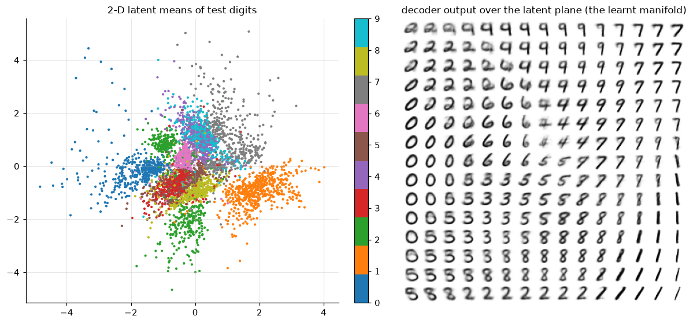<br>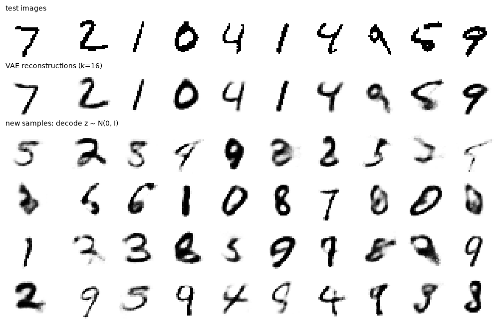</p>

### Denoising diffusion (DDPM)

**Forward process** (fixed, no learning): add a little Gaussian noise at each of $T=100$ steps.
In closed form,

$$ x_t=\sqrt{\bar\alpha_t}\,x_0+\sqrt{1-\bar\alpha_t}\,\varepsilon,\qquad \bar\alpha_t=\prod_{s\le t}(1-\beta_s), $$

with $\beta$ linear from $10^{-4}$ to $0.1$, so $x_T$ is essentially pure noise.
**Training**: a network $\varepsilon_\theta(x_t,t)$, an MLP with a sinusoidal time embedding,
learns to predict the added noise by minimising $\lVert\varepsilon_\theta(x_t,t)-\varepsilon\rVert^2$.
**Sampling** runs the chain backwards from pure noise:

$$ x_{t-1}=\frac{1}{\sqrt{1-\beta_t}}\Big(x_t-\frac{\beta_t}{\sqrt{1-\bar\alpha_t}}\varepsilon_\theta(x_t,t)\Big)+\sqrt{\beta_t}\,z . $$

**What the network learns, checked exactly.** The optimal noise predictor is the **score** of
the noised data distribution, $\varepsilon^*(x,t)=-\sqrt{1-\bar\alpha_t}\,\nabla_x\log q_t(x)$.
Our data are a mixture of 8 Gaussians, so $q_t$ is again a Gaussian mixture, with means
$\sqrt{\bar\alpha_t}\mu_k$ and variance $\bar\alpha_t\sigma^2+1-\bar\alpha_t$. Its score is known
in closed form, which lets us:
1. measure the error of the learnt $\varepsilon_\theta$ against $\varepsilon^*$ at every $t$;
2. run the sampler with the **exact** score, separating *sampler* error from *learning* error.

<p align="center">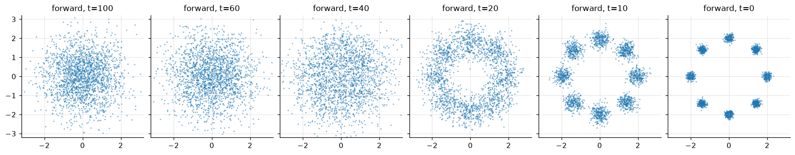<br>
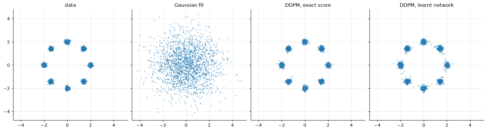<br>
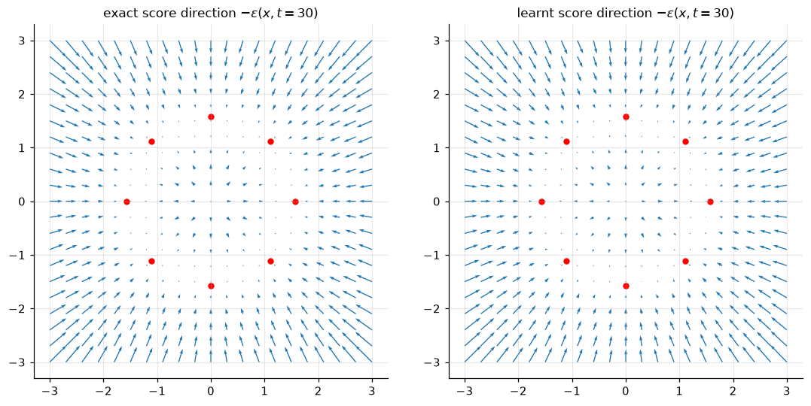 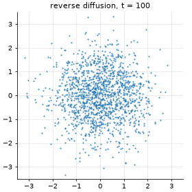</p>

<!-- results:10 -->
| model (binarised MNIST, test set) | −ELBO (nats) | reconstruction + KL | IWAE NLL, K = 100 (nats) |
|---|---|---|---|
| independent Bernoulli pixels (exact NLL, trivial baseline) | - | - | 200.1 |
| VAE, latent 2 | 137.2 | 130.3 + 6.9 | 132.4 |
| VAE, latent 16 | 83.9 | 61.1 + 22.9 | 76.8 |

| sampler (4000 samples) | MMD² vs data | within 3σ of a mode | modes covered |
|---|---|---|---|
| fresh data (metric noise floor) | -2.0e-04 | 98.8% | 8/8 |
| DDPM with exact score | -9.1e-05 | 98.1% | 8/8 |
| DDPM, learnt network | 1.0e-03 | 93.9% | 8/8 |
| Gaussian fit (baseline) | 1.6e-01 | 6.0% | 8/8 |

Relative RMS error of the learnt noise predictor vs the exact $\epsilon^*$: t=0: 2.241, t=10: 0.165, t=20: 0.083, t=30: 0.074, t=40: 0.040, t=50: 0.030, t=60: 0.023, t=70: 0.027, t=80: 0.019, t=90: 0.021, t=99: 0.040.
<!-- /results:10 -->

**Reading the numbers.** The VAE with a 16-D latent reaches about 77 nats against 200 for the
independent-pixel model. The 2-D VAE is worse but gives the interpretable manifold shown above.
The diffusion sampler with the exact score is indistinguishable from the data: its MMD² is at the
metric's noise floor, and negative values are possible for the unbiased estimator. The learnt
model covers all 8 modes but puts about 6 % of its samples between them. The largest score
errors are at the smallest noise levels ($t=0$). There the exact score is extremely steep
(noise std 0.01 against a mode width of 0.1) and hard to fit, but those steps barely move the
samples. The single Gaussian baseline, of course, fails completely.

---

## Lesson 11 - Self-organising maps and Hopfield networks

📄 [`lessons/11_som_hopfield/lesson.py`](lessons/11_som_hopfield/lesson.py) · 📓 [`notebooks/11_som_hopfield.ipynb`](notebooks/11_som_hopfield.ipynb) · code: [`nnaz/som_hopfield.py`](nnaz/som_hopfield.py)

Two classics that learn **without backpropagation**. Both are still useful to engineers:
SOMs for visualising and clustering high-dimensional data (sensor data, flow regimes, design
spaces), and Hopfield networks as the ancestor of associative memory and of attention.

### Self-organising map (Kohonen, 1982)

A 2-D grid of units, each holding a prototype vector $w_j$ in data space. For each input $x$:

$$
b=\arg\min_j\lVert x-w_j\rVert \quad\text{(competition)},\qquad
w_j\leftarrow w_j+\eta(t)\,e^{-\lVert r_j-r_b\rVert^2/2\sigma(t)^2}\,(x-w_j)\quad\text{(cooperation)},
$$

where $r_j$ is the unit's position **on the grid**. The best-matching unit *and its grid
neighbours* move towards the input, and $\eta$ and $\sigma$ shrink over time. As a result,
units that are neighbours on the grid end up with similar prototypes. The map is a
topology-preserving, discretised 2-D projection of the data: a nonlinear cousin of PCA, or
"k-means with a map". The **batch SOM** (used for MNIST) replaces each prototype by the
neighbourhood-weighted mean of the data. It is deterministic and vectorises well.

Two quality measures:
* **quantisation error**: mean distance from a sample to its best prototype (lower = better fit);
* **topographic error**: fraction of samples whose best and second-best units are *not*
  adjacent on the grid (lower = better ordered).

<p align="center">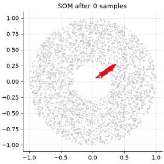 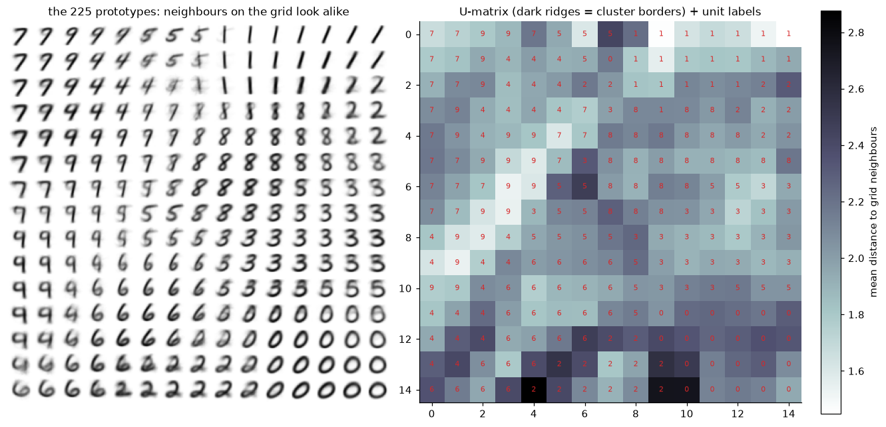</p>

The U-matrix shows the average distance between neighbouring prototypes. Dark ridges are
cluster borders; the digit label of each unit is overlaid.

### Hopfield networks: a network with feedback loops

$N$ binary neurons $s_i=\pm1$ with symmetric weights and no self-connections. Every neuron feeds
back into all the others, and asynchronous updates $s_i\leftarrow\operatorname{sign}(\sum_jW_{ij}s_j)$
can never increase the **energy**

$$ E(s)=-\tfrac12\,s^\top Ws . $$

The state therefore rolls downhill into a local minimum. If the memories are minima, this is a
**content-addressable memory**: start from a corrupted pattern and the dynamics complete it.

* **Hebbian rule** ("fire together, wire together"): $W=\frac1N\sum_\mu\xi^\mu\xi^{\mu\top}$.
  Capacity for random patterns is about $0.138N$ (Amit, Gutfreund and Sompolinsky, 1985). It
  assumes nearly **uncorrelated** patterns.
* **Projection (pseudo-inverse) rule**: $W=P^\top(PP^\top)^{-1}P$. Every stored pattern is an
  exact fixed point, even for strongly correlated patterns.
* **Modern Hopfield network** (Ramsauer et al., 2020):
  $s\leftarrow P^\top\operatorname{softmax}(\beta Ps)$. This is exactly the **attention** of
  lesson 08: the stored patterns are keys and values, the probe is the query. Its capacity grows
  exponentially with $N$.

Our letters share most of their white background: the maximum pairwise overlap is about 0.9. The
Hebbian network therefore falls into mixture states and recalls **none** of them exactly. The
projection rule and the modern network recall all of them. On random patterns, the measured
capacity curve collapses near the theoretical $0.138N$.

<p align="center">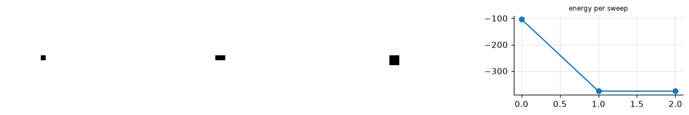<br>
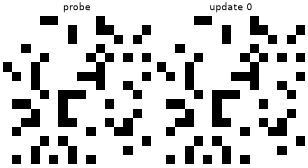 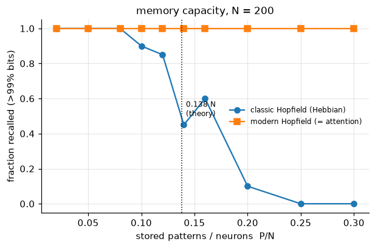</p>

<!-- results:11 -->
*(results table is generated from `docs/results/lessonNN.json` by the next full `run.py` pass)*
<!-- /results:11 -->

---

## Lesson 12 - The Differentiable Neural Computer (memory-augmented networks)

📄 [`lessons/12_dnc_memory/lesson.py`](lessons/12_dnc_memory/lesson.py) · 📓 [`notebooks/12_dnc_memory.ipynb`](notebooks/12_dnc_memory.ipynb) · code: [`nnaz/dnc.py`](nnaz/dnc.py)

An LSTM stores everything in a fixed-size state vector. To remember more, it must grow its
weights. A **Differentiable Neural Computer** (Graves et al., *Nature* 2016) separates computing
from storage. A neural **controller** (here a small LSTM) reads and writes an external
**memory matrix** $M\in\mathbb R^{N\times W}$ (32 slots × 16 numbers). All memory access is
*soft attention* over slots, so the whole machine is differentiable and trains with ordinary
backpropagation. At every step the controller emits an **interface vector** that sets:

| mechanism | equations | purpose |
|---|---|---|
| content addressing | $c=\operatorname{softmax}\big(\beta\cos(M_i,k)\big)$ | find a slot by *what* it contains |
| usage & allocation | $u\leftarrow(u+w^w-u\odot w^w)\odot\prod_r(1-f_rw^r_r)$; $a_{\phi_j}=(1-u_{\phi_j})\prod_{i<j}u_{\phi_i}$ | find *free* slots ($\phi$ = slots sorted by usage) |
| write | $w^w=g^w\,(g^a a+(1-g^a)c^w)$; $M\leftarrow M\odot(1-w^we^\top)+w^wv^\top$ | erase, then add |
| temporal links | $L_{ij}\leftarrow(1-w^w_i-w^w_j)L_{ij}+w^w_ip_j$; $p\leftarrow(1-\sum w^w)p+w^w$ | remember the *order* of writes |
| read | $w^r=\pi_1(L^\top w^r)+\pi_2c^r+\pi_3(Lw^r)$; $r=M^\top w^r$ | read backwards, by content, or forwards |

**The copy task.** The network reads $L$ random 6-bit vectors and a delimiter, then must output
the same $L$ vectors. It is trained on $L\in[1,10]$ and tested up to $L=24$. A DNC can solve
this with an *algorithm*: write each input to a fresh (allocated) slot, then follow the
temporal links forward while reading. That algorithm does not depend on $L$, as long as the
memory has enough slots.

<p align="center"><br></p>

Each input is written to one fresh slot: a single bright cell per time step. The slots are
scattered because allocation picks whichever slots are least used. During the output phase, the
read weightings visit **exactly the same slots in the same order**. The network has discovered
"allocate, write, then follow the temporal links" by itself. This is why it keeps working at
lengths it never saw, until the 32 slots start to run out (the few errors at $L\ge20$).

<!-- results:12 -->
| bit error rate at length L | L=2 (train) | L=5 (train) | L=10 (train) | L=12 | L=16 | L=20 | L=24 |
|---|---|---|---|---|---|---|---|
| DNC | 0.000 | 0.000 | 0.000 | 0.000 | 0.000 | 0.016 | 0.023 |
| LSTM | 0.000 | 0.001 | 0.037 | 0.143 | 0.419 | 0.497 | 0.501 |

Parameters: DNC 27,950 (LSTM controller 64 + 32 × 16 memory), LSTM baseline 203,014 (2 × 128). Training: 6000 steps; DNC 6.5 min, LSTM 0.8 min on CPU. Chance level is 0.5.
<!-- /results:12 -->

---

## Lesson 13 - Spatial graph neural networks on unstructured meshes

📄 [`lessons/13_graph_nn_mesh/lesson.py`](lessons/13_graph_nn_mesh/lesson.py) · 📓 [`notebooks/13_graph_nn_mesh.ipynb`](notebooks/13_graph_nn_mesh.ipynb) · code: [`nnaz/gnn.py`](nnaz/gnn.py)

CFD and FEM meshes are not images, so CNNs do not apply directly. A mesh *is* a **graph**:
vertices carry node features (source term, coordinates, boundary flag), and mesh edges carry
edge features (the relative position $x_j-x_i$ and its length).

### The reference solver: P1 finite elements

We solve $-\Delta u=f$ on the unit square with $u=0$ on the boundary, on jittered Delaunay
meshes. On each triangle $T$ the hat functions have constant gradients $G$, the element
stiffness is $K_T=|T|\,GG^\top$, and the consistent mass matrix is
$M_T=\frac{|T|}{12}\begin{psmallmatrix}2&1&1\\1&2&1\\1&1&2\end{psmallmatrix}$. We assemble,
apply the Dirichlet condition, and solve the sparse system. The solver is **verified** with the
manufactured solution $u=\sin\pi x\sin\pi y$ (so $f=2\pi^2u$): the error drops by 4× per mesh
halving (second order).

### Two families of GNN layers

* **Spectral-derived: GCN** (Kipf and Welling, 2017). Filtering on the graph Laplacian reduces to
  $H'=\sigma(\tilde D^{-1/2}(A+I)\tilde D^{-1/2}HW)$. Each neighbour is averaged with a *fixed,
  isotropic* weight. The layer cannot tell a neighbour to the east from one to the west.
* **Spatial message passing: MPNN / MeshGraphNets** (Gilmer et al. 2017; Pfaff et al. 2021).
  $$ m_{ij}=\phi_e\big(h_i,h_j,e_{ij}\big),\qquad h_i\leftarrow h_i+\phi_v\Big(h_i,\sum_{j\in\mathcal N(i)}m_{ij}\Big) . $$
  The messages see the **edge geometry**, so the layer can build anisotropic, stencil-like
  operators: a learnt analogue of a finite-volume flux or a row of the FEM stiffness matrix.

Both use 12 layers, with the Dirichlet condition built into the output, so information travels
at most 12 edges. The Poisson problem is elliptic: every node influences every other node. On a
20×20 mesh 12 hops cover most of the domain; on a 30×30 mesh they do not. This is a real
limitation, and the finer-mesh test measures it.

<p align="center">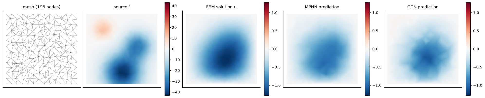<br>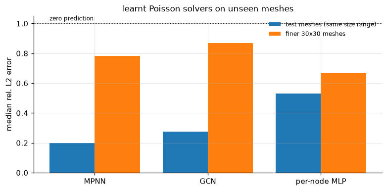</p>

<!-- results:13 -->
*(results table is generated from `docs/results/lessonNN.json` by the next full `run.py` pass)*
<!-- /results:13 -->

---

## Lesson 14 - Neural operators: DeepONet and the Fourier Neural Operator

📄 [`lessons/14_neural_operators/lesson.py`](lessons/14_neural_operators/lesson.py) · 📓 [`notebooks/14_neural_operators.ipynb`](notebooks/14_neural_operators.ipynb) · code: [`nnaz/operators.py`](nnaz/operators.py)

A PINN (lesson 09) solves **one** PDE instance. A parameter surrogate maps a few numbers to a
solution. A **neural operator** learns the whole *solution operator*, a map between function
spaces. Here it is $\mathcal G:u_0(\cdot)\mapsto u(\cdot,T)$ for viscous Burgers on a periodic
domain. After training, one forward pass solves the PDE for **any** new initial condition.

**Data.** $u_0$ is drawn from a periodic Gaussian random field with covariance
$\sigma^2(-\Delta+\tau^2)^{-2}$, as in the FNO paper. The PDE $u_t+(u^2/2)_x=\nu u_{xx}$ with
$\nu=0.01$ is solved to $T=1$ with our **pseudo-spectral** solver: Fourier derivatives, 2/3-rule
de-aliasing, and an **integrating factor** $e^{\nu k^2t}$ that treats diffusion exactly. With
diffusion handled exactly, RK4 time steps are limited only by advection. The solver agrees with
the exact Cole-Hopf solution to $10^{-10}$. We use 1000 training and 200 test pairs on a 128-point
grid (the data are solved on 512 points and subsampled).

**DeepONet** (Lu et al., 2021) is inspired by the universal approximation theorem for operators:

$$ \mathcal G(u_0)(x)\approx\sum_{k=1}^{p} \underbrace{b_k\big(u_0(x_1),\dots,u_0(x_m)\big)}_{\text{branch net}}\;\underbrace{t_k(x)}_{\text{trunk net}}+b_0 . $$

The branch net reads the input function at $m$ fixed sensors and produces coefficients. The
trunk net produces basis functions of the query location $x$, encoded as $(\cos2\pi x,\sin2\pi x)$
so periodicity is built in. It is a learnt, nonlinear reduced-basis expansion.

**FNO** (Li et al., 2021) stacks layers that combine a pointwise linear map with a **global
convolution learnt in Fourier space**:

$$ v\leftarrow\sigma\Big(Wv+\mathcal F^{-1}\big[R_k\cdot\mathcal F[v]_k\big]_{k\le k_\max}\Big). $$

The weights $R_k$ live on the lowest $k_\max=16$ Fourier modes, not on grid points. The same
trained network can therefore be evaluated on a **finer grid** than it was trained on
(zero-shot super-resolution). We test that on the 512-point grid.

<p align="center"><br></p>

<!-- results:14 -->
| operator (test set, 200 new u0) | mean relative L2 error |
|---|---|
| identity  u(T) = u0 | 2.374 |
| best linear operator (least squares) | 0.614 |
| DeepONet | 0.0357 |
| FNO | **0.0024** |
| FNO evaluated on the 512-point grid (trained on 128) | 0.0023 |
| DeepONet queried at 512 points | 0.0357 |

Cost per sample: spectral solver 129 ms (batched), FNO 1.01 ms. Training on CPU: DeepONet 58 s, FNO 375 s. The solver's own resolution check (2× finer grid): 2.4e-12.
<!-- /results:14 -->

---

## Lesson 15 - Physics-structured networks: Hamiltonian neural networks and neural ODEs

📄 [`lessons/15_hamiltonian_neural_ode/lesson.py`](lessons/15_hamiltonian_neural_ode/lesson.py) · 📓 [`notebooks/15_hamiltonian_neural_ode.ipynb`](notebooks/15_hamiltonian_neural_ode.ipynb) · code: [`nnaz/physics_nets.py`](nnaz/physics_nets.py)

### Hamiltonian neural networks

A frictionless mechanical system is described by one scalar, the energy $H(q,p)$, through
Hamilton's equations $\dot q=\partial H/\partial p,\ \dot p=-\partial H/\partial q$. Two ways to
learn the pendulum ($H=p^2/2+1-\cos q$) from 50 noisy trajectories:

* **baseline**: an MLP maps $(q,p)\mapsto(\dot q,\dot p)$. It can represent *any* vector field,
  including ones that slowly gain or lose energy;
* **HNN** (Greydanus et al., 2019): an MLP outputs the scalar $H_\theta(q,p)$. The vector field is
  its **symplectic gradient**, computed by autograd: $(\partial_pH_\theta,-\partial_qH_\theta)$.
  Along this field $\dot H_\theta=\partial_qH_\theta\,\dot q+\partial_pH_\theta\,\dot p=0$
  **identically**. Energy conservation is built in, not learnt.

Both fields are integrated with the same RK4 scheme for 100 time units (about 15 periods) from
unseen initial states.

<p align="center">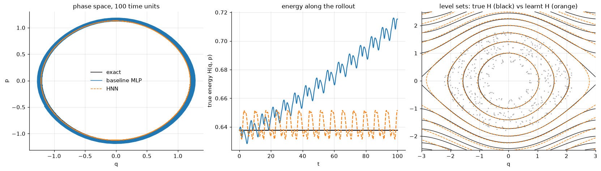<br>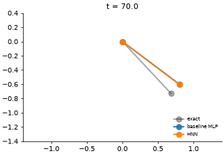</p>

### Neural ODEs

A **neural ODE** (Chen et al., 2018) models $\dot x=f_\theta(x)$ and is fitted to *trajectory
samples*, with no derivatives needed. We integrate the ODE with a differentiable RK4 solver and
backpropagate through the solver steps. Here the data are **120 irregularly timed**, noisy
observations of the Lotka-Volterra predator-prey system
($\dot u=au-buv,\ \dot v=-cv+duv$). A continuous-time model handles irregular sampling
naturally. We use **multiple shooting**: short windows, each started from an observed state,
which keeps the gradients well-behaved. The model works in log-populations for positivity. The
baseline is the best **linear** ODE $\dot z=Az+b$ in log space, fitted by least squares to finite
differences.

<p align="center">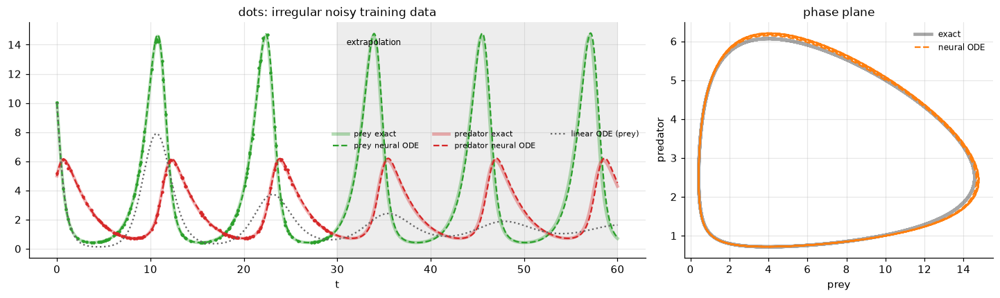</p>

<!-- results:15 -->
*(results table is generated from `docs/results/lessonNN.json` by the next full `run.py` pass)*
<!-- /results:15 -->

---

## Lesson 16 - Reduced-order modelling for CFD: POD vs a convolutional autoencoder

📄 [`lessons/16_rom_cfd/lesson.py`](lessons/16_rom_cfd/lesson.py) · 📓 [`notebooks/16_rom_cfd.ipynb`](notebooks/16_rom_cfd.ipynb) · code: [`nnaz/lbm.py`](nnaz/lbm.py), [`nnaz/rom.py`](nnaz/rom.py)

### The CFD data: our own lattice-Boltzmann solver

The **lattice Boltzmann method** evolves particle distributions $f_i$ along the 9 velocities of a
D2Q9 lattice, alternating a **collision** (BGK relaxation to a local equilibrium) and a
**streaming** step:

$$
f_i^*=f_i-\frac{1}{\tau}\big(f_i-f_i^{\rm eq}(\rho,\mathbf u)\big),\qquad f_i(\mathbf x+\mathbf c_i,t+1)=f_i^*(\mathbf x,t),\qquad
f_i^{\rm eq}=w_i\rho\Big[1+3\,\mathbf c_i\!\cdot\!\mathbf u+\tfrac92(\mathbf c_i\!\cdot\!\mathbf u)^2-\tfrac32|\mathbf u|^2\Big].
$$

A Chapman-Enskog expansion shows that this recovers the incompressible Navier-Stokes equations
with $\nu=(\tau-\frac12)/3$. We simulate flow past a cylinder ($D=16$ cells, $U=0.1$, Re = 100,
400×100 grid) with bounce-back on the cylinder (no-slip), a velocity inlet, a zero-gradient
outlet and periodic side boundaries. **Validation:** the Strouhal number $St=fD/U$ of the vortex
shedding, measured by FFT at a wake probe, is compared with Williamson's (1988) fit for
unconfined flow, $St=0.2175-5.1064/\mathrm{Re}$.

<p align="center">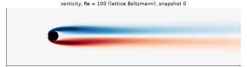</p>

### Compression: POD vs a convolutional autoencoder

**POD** (proper orthogonal decomposition) is PCA of the snapshot matrix. It is the workhorse of
CFD model reduction. The SVD of the mean-subtracted snapshots gives orthonormal spatial modes
ranked by energy, and truncating to $r$ modes is the optimal *linear* compression (lesson 07). A
periodic wake is a **limit cycle**: its state is essentially one phase angle. POD needs a
**pair** of modes (sine and cosine) for every harmonic of the shedding frequency, as the paired
spectrum below shows. A *nonlinear* autoencoder can map the cycle onto a closed curve in a 2-D
latent space. We train on the first 75 % of the snapshots and test on the last 25 %.

<p align="center">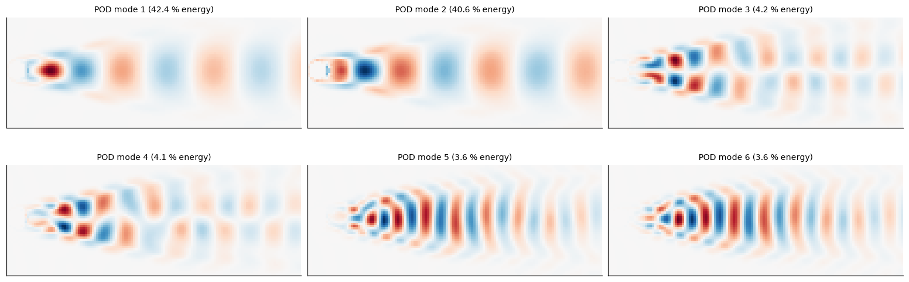<br>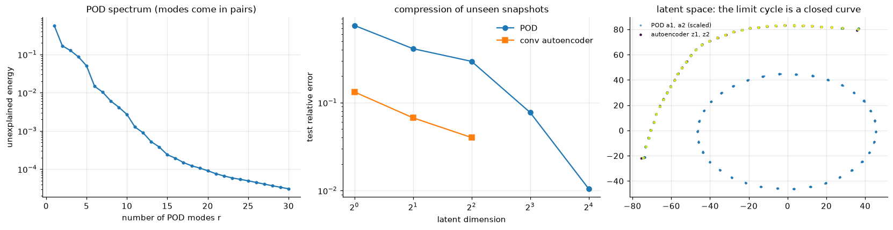<br>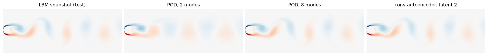</p>

### Forecasting in the reduced space

* **DMD** (dynamic mode decomposition): the best *linear* propagator $a_{n+1}=a_nM$ of the POD
  coefficients, fitted by least squares. Its eigenvalues give the shedding frequency and growth
  rates.
* **Neural latent map**: $z_{n+1}=z_n+g_\theta(z_n)$ in the autoencoder's 2-D latent space,
  trained on 5-step rollouts, then decoded.

<!-- results:16 -->
*(results table is generated from `docs/results/lessonNN.json` by the next full `run.py` pass)*
<!-- /results:16 -->

---

## Lessons learned / bugs found

* **A gradient checker can be wrong too.** The first version of `gradient_check` copied the
  backprop gradient of each tensor *inside* the loop, after the previous tensor's
  finite-difference evaluations had re-run `backward` at a **perturbed** point. The reported
  error scaled like $\epsilon$ (1e-6 at $\epsilon$=1e-5, 1e-7 at $\epsilon$=1e-6) instead of
  $\epsilon^2$. The fix is to snapshot all analytic gradients before perturbing anything. The
  tell-tale sign: an error that is proportional to $\epsilon$.
* **Element-wise relative errors mislead.** A gradient entry of $10^{-7}$ has a relative round-off
  error of about $10^{-3}$ at $\epsilon=10^{-6}$ even when the code is right. We therefore compare
  whole tensors (norm-wise).
* **A bias before BatchNorm has an exactly zero gradient.** BN subtracts the batch mean, so the
  bias cancels. The relative error of $0/0$ then reads as 1.0. The bias is redundant, so it is
  removed.
* **ReLU kinks.** With $\epsilon=10^{-5}$ one ReLU check failed (error 2e-2): a pre-activation was
  within $10^{-5}$ of zero. Smaller steps, or a smooth activation, avoid this.
* **Overfitting needs a reason to happen.** With clean, angle-noise-only spirals, even a huge
  network generalised (99 % validation accuracy), so the first demo showed nothing. Label noise
  makes memorisation visible.

* **Identical code, different numbers: chaos, not a bug (lesson 04).** NumPy and PyTorch agreed
  to $10^{-16}$ for 160 gradient-descent steps at lr = 0.5, then diverged to $O(1)$. The loss
  spike showed that GD had become unstable at that step size. Unstable, chaotic dynamics amplify
  round-off, so bit-for-bit comparisons only make sense at a stable learning rate. At lr = 0.1 they
  agree to $4\times10^{-16}$ for all 300 steps.
* **Two jobs on four cores are slower than one after the other.** Running two PyTorch lessons at
  once, each with `torch.set_num_threads(4)`, oversubscribed the CPU. One CNN training went from
  34 s to 765 s. The timings in this README therefore come from sequential runs.
* **A denoiser that predicted almost nothing (lesson 07).** The first convolutional denoiser
  output the clean image directly through a sigmoid. After several epochs it scored 9.9 dB, barely
  better than the noisy input (9.4 dB). Its loss was still *above* that of predicting a blank
  image, so it was learning very slowly rather than wrongly. **Residual learning** (predict the
  correction $f$ and output $\tilde x+f(\tilde x)$, with $f$ initialised to zero, as in DnCNN) fixed
  it immediately: about 16 dB after one short epoch.
* **The cell Reynolds number is real (lesson 09).** Central differencing of $u\,u_x$ gave an error
  that barely changed from N = 128 to 256, because $|u|\Delta x/\nu > 2$ there. Convergence at the
  design order only starts once the cell Reynolds number drops below 2. Neural networks do not
  remove the need to know your numerics.
* **Adam alone does not finish a PINN.** For the Burgers PINN, Adam stalls at 10-20 % relative
  error. L-BFGS then gains two orders of magnitude in a few thousand iterations.
* **Surrogates must be compared with interpolation.** On a 2-parameter problem, piecewise-linear
  interpolation between the 400 solver runs was *more* accurate than the neural surrogate. We report
  it as is.
* **`numpy.polynomial.hermite.hermgauss` overflows above about 300 nodes.** It returns NaNs
  silently. 120-200 nodes already give the Cole-Hopf solution to $10^{-15}$.

## Repository layout and tests

```
nnaz/                 shared, importable course code (one module per topic)
lessons/NN_topic/     the runnable lesson scripts
notebooks/            the lessons as Jupyter notebooks (generated by run.py, executed)
docs/lessonNN/        figures and GIFs;  docs/results/*.json: numbers of the last run
tests/                pytest: gradient checks, loss decreases, beats-baseline, error thresholds
run.py                regenerates every figure, GIF, table and notebook
```

The tests (`pytest`, under 2 minutes on CPU) check the following:

* hand gradients and backprop against finite differences (< 1e-6);
* that the loss decreases in smoke runs;
* that every model beats a trivial baseline;
* the scientific-ML error thresholds.

## References

* F. Rosenblatt (1958), *The perceptron: a probabilistic model for information storage and organization in the brain*, Psychological Review 65.
* A. Novikoff (1962), *On convergence proofs for perceptrons*, Symposium on the Mathematical Theory of Automata.
* D. Rumelhart, G. Hinton, R. Williams (1986), *Learning representations by back-propagating errors*, Nature 323.
* X. Glorot, Y. Bengio (2010), *Understanding the difficulty of training deep feedforward neural networks*, AISTATS.
* K. He, X. Zhang, S. Ren, J. Sun (2015), *Delving deep into rectifiers*, ICCV.
* S. Ioffe, C. Szegedy (2015), *Batch normalization*, ICML.
* N. Srivastava et al. (2014), *Dropout: a simple way to prevent neural networks from overfitting*, JMLR 15.
* D. Kingma, J. Ba (2015), *Adam: a method for stochastic optimization*, ICLR.
* I. Loshchilov, F. Hutter (2017), *SGDR: stochastic gradient descent with warm restarts*, ICLR.
* A. Karpathy, *CS231n notes* and *char-rnn* (Tiny Shakespeare data).
