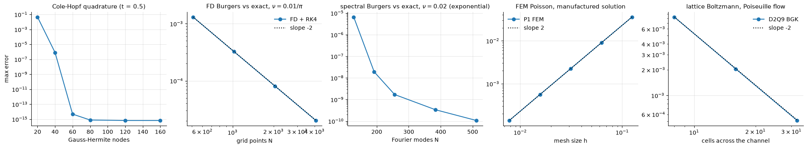

<!-- generated from the root README by nnaz/report.py -->
[course overview](../README.md)

# The CFD / PDE solvers behind the course

(Also available as a separate page: [`docs/SOLVERS.md`](../docs/SOLVERS.md).)

Several lessons train networks on, or compare them with, the output of **classical numerical
solvers written for this course**. They live in `nnaz/` next to the networks, are documented
line by line, and are verified against exact solutions by
[`validate_solvers.py`](../validate_solvers.py), which runs in about 30 s.

| solver | file | equation | method | used in | verification |
|---|---|---|---|---|---|
| Cole-Hopf exact solution | [`nnaz/burgers.py`](../nnaz/burgers.py) | viscous Burgers | Hopf-Cole transform + Gauss-Hermite quadrature | 09, 14 | quadrature converged to $10^{-15}$ |
| finite-difference solver | [`nnaz/burgers.py`](../nnaz/burgers.py) | viscous Burgers | 2nd-order central FD (conservative flux form) + classical RK4 | 09 | order **2.0** vs Cole-Hopf |
| pseudo-spectral solver | [`nnaz/operators.py`](../nnaz/operators.py) | viscous Burgers, periodic | Fourier Galerkin/collocation, 2/3 de-aliasing, integrating-factor RK4 | 14 | **exponential** convergence vs Cole-Hopf |
| finite-element solver | [`nnaz/gnn.py`](../nnaz/gnn.py) | Poisson, Dirichlet | P1 (linear) triangles on Delaunay meshes, sparse direct solve | 13 | order **2.0**, manufactured solution |
| lattice Boltzmann | [`nnaz/lbm.py`](../nnaz/lbm.py) | incompressible Navier-Stokes (2-D) | D2Q9, BGK collision, bounce-back walls | 16 | order **2.0** on Poiseuille flow; Strouhal number vs Williamson |

### 1. Burgers equation: exact solution by the Cole-Hopf transform

$u_t+uu_x=\nu u_{xx}$ becomes the heat equation $\phi_t=\nu\phi_{xx}$ under
$u=-2\nu\,\phi_x/\phi$. For $u_0=-A\sin\pi x$ the heat-equation solution is a Gaussian
convolution. After substituting $\eta=\sqrt{4\nu t}\,z$, both integrals carry the weight
$e^{-z^2}$ and are evaluated with Gauss-Hermite quadrature. Numerics: the integrand contains
$f=\exp(-A\cos\pi y/2\pi\nu)$, up to $e^{50}$, so the code uses $\log f$ and subtracts its maximum
(log-sum-exp). NumPy's `hermgauss` overflows above about 300 nodes; 60-200 are enough.

### 2. Burgers equation: finite differences + RK4 (method of lines)

On a uniform periodic grid (the odd, 2-periodic initial condition makes this equivalent to the
Dirichlet problem on $[-1,1]$):

$$
\frac{du_j}{dt}=-\frac{F_{j+1}-F_{j-1}}{2\Delta x}+\nu\,\frac{u_{j+1}-2u_j+u_{j-1}}{\Delta x^2},\qquad F=\tfrac12u^2,
$$

integrated with classical 4th-order Runge-Kutta. Stability and accuracy:
* the **cell Reynolds number** $|u|\Delta x/\nu<2$ is needed for central convection to stay free of wiggles;
* the time step obeys the diffusive limit $\Delta t\lesssim\Delta x^2/\nu$ and the convective (CFL) limit $\Delta t\lesssim\Delta x/|u|$, with a safety factor 0.4;
* the solver is vectorised over a *batch* of parameters $(\nu, A)$, so the 400 training runs of the lesson-09 surrogate advance together.

### 3. Burgers equation: pseudo-spectral + integrating factor

For smooth periodic solutions, Fourier derivatives are exact up to round-off:
$\widehat{u_x}=ik\hat u$. The nonlinear term is computed in physical space and transformed back.
The top third of the modes is zeroed (the **2/3 rule**) to remove aliasing from the quadratic
product. The stiff diffusion term is treated **exactly** through the integrating factor
$v=e^{\nu k^2t}\hat u$:

$$ \frac{dv}{dt}=e^{\nu k^2t}\,\widehat{N}(u),\qquad \widehat{N}=-\tfrac{ik}{2}\widehat{u^2}, $$

and this non-stiff system is advanced with RK4 (the Lawson / IF-RK4 scheme). The time step is
then limited by advection only. The error decays **exponentially** with the number of modes,
from $7\times10^{-6}$ at 128 modes to $10^{-10}$ at 512 ($\nu=0.02$). Beyond about 256 modes it levels
off, because the RK4 time-stepping error, not the spatial resolution, then dominates.

### 4. Poisson equation: P1 finite elements

Weak form: find $u\in H^1_0$ with $\int\nabla u\cdot\nabla v=\int fv$ for all test functions $v$.
With piecewise-linear "hat" functions on a triangulation, the gradients are constant per
triangle, $G=\begin{pmatrix}-1&-1\\1&0\\0&1\end{pmatrix}B^{-1}$, where
$B=[p_1-p_0,\ p_2-p_0]$. The element matrices are

$$ K_T=|T|\,GG^\top,\qquad M_T=\frac{|T|}{12}\begin{pmatrix}2&1&1\\1&2&1\\1&1&2\end{pmatrix},\qquad F=Mf_h . $$

They are assembled into sparse global matrices. Dirichlet nodes are eliminated, and the system
is solved with SciPy's sparse direct solver. Meshes are jittered grids triangulated by
`scipy.spatial.Delaunay`, so every training graph in lesson 13 is a different unstructured
mesh.

### 5. Navier-Stokes: the lattice Boltzmann method (D2Q9-BGK)

Instead of discretising the Navier-Stokes equations directly, LBM evolves particle
distribution functions $f_i(\mathbf x,t)$ along 9 discrete velocities $\mathbf c_i$ (rest,
4 axis, 4 diagonal; weights 4/9, 1/9, 1/36):

$$
\underbrace{f_i^*=f_i-\tfrac1\tau\big(f_i-f_i^{\rm eq}\big)}_{\text{collision (local)}},\qquad
\underbrace{f_i(\mathbf x+\mathbf c_i,t+1)=f_i^*(\mathbf x,t)}_{\text{streaming (exact shift)}},\qquad
f_i^{\rm eq}=w_i\rho\Big[1+3\mathbf c_i\!\cdot\!\mathbf u+\tfrac92(\mathbf c_i\!\cdot\!\mathbf u)^2-\tfrac32|\mathbf u|^2\Big],
$$

with $\rho=\sum_if_i$ and $\rho\mathbf u=\sum_i\mathbf c_if_i$. A Chapman-Enskog multiscale
expansion shows that the moments obey the incompressible Navier-Stokes equations, with
kinematic viscosity $\nu=(\tau-\tfrac12)/3$ and sound speed $c_s=1/\sqrt3$ (lattice units),
up to $O(\mathrm{Ma}^2)$ compressibility errors. We use $\mathrm{Ma}=U/c_s\approx0.17$.

Boundary conditions in the cylinder simulation:
* **no-slip walls** (cylinder): full bounce-back, where populations hitting a solid node are
  returned in the opposite direction;
* **inlet**: velocity imposed through the equilibrium of the incoming populations, with the
  density reconstructed from the known populations (Zou-He style);
* **outlet**: zero-gradient (the unknown populations are copied from the neighbouring column);
* **sides**: periodic.

Symmetry breaking: an initial asymmetric transverse velocity "kick" behind the cylinder.
Without it the symmetric steady wake survived for about 24 000 steps before round-off
triggered shedding (see lessons learned).

**Verification.** (a) **Poiseuille flow**: a body-force-driven channel with half-way
bounce-back walls has the exact parabolic profile $u(y)=\frac{g}{2\nu}(y+\frac12)(n_y-\frac12-y)$.
The error converges at order 2. (b) **Cylinder wake at Re = 100**: the Strouhal number of the
vortex shedding is compared with Williamson's (1988) correlation for an unconfined cylinder
(lesson 16).

<!-- results:solvers -->
| solver | resolutions | errors | observed order |
|---|---|---|---|
| FD Burgers, rel. L2 vs Cole-Hopf (t = 1, ν = 0.01/π) | 512 / 1024 / 2048 / 4096 | 1.3e-03 / 3.2e-04 / 8.1e-05 / 2.0e-05 | 2.01 |
| spectral Burgers, max error vs Cole-Hopf (ν = 0.02) | 128 / 192 / 256 / 384 / 512 | 6.6e-06 / 1.9e-08 / 1.7e-09 / 3.3e-10 / 1.1e-10 | exponential |
| P1 FEM Poisson, rel. L2 (manufactured) | 9² / 17² / 33² / 65² / 129² | 3.6e-02 / 9.0e-03 / 2.2e-03 / 5.6e-04 / 1.4e-04 | 2.00 |
| LBM Poiseuille, max rel. error | 8 / 16 / 32 | 8.3e-03 / 2.0e-03 / 5.1e-04 | 2.01 |
<!-- /results:solvers -->

Run the verification: `python validate_solvers.py`
