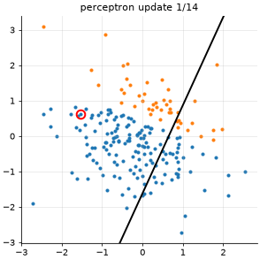
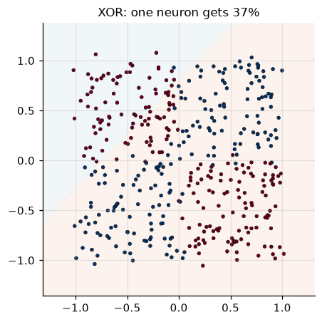
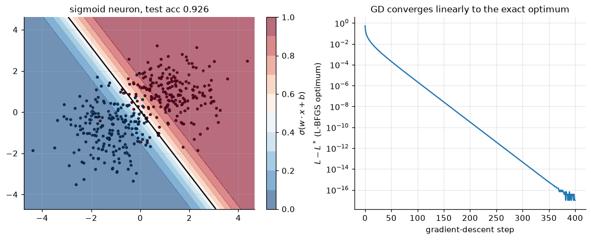

<!-- generated from the root README by nnaz/report.py - edit the root README instead -->
[course overview](../../README.md) · [02_mlp_numpy →](../02_mlp_numpy/README.md)

# Lesson 01 - The single neuron: perceptron and logistic regression

📄 [`lessons/01_perceptron/lesson.py`](../../lessons/01_perceptron/lesson.py) · 📓 [`notebooks/01_perceptron.ipynb`](../../notebooks/01_perceptron.ipynb) · code: [`nnaz/neuron.py`](../../nnaz/neuron.py)

**What a neuron computes.** A weighted sum followed by a non-linearity:

$$ z = w\cdot x + b, \qquad a = \varphi(z). $$

The set $\{x : w\cdot x+b=0\}$ is a straight line (a hyperplane in $D$ dimensions): **a single
neuron can only draw one linear decision boundary**.

### The perceptron (Rosenblatt, 1958)

With $\varphi=\operatorname{sign}$ and labels $y\in\{-1,+1\}$, the learning rule is: visit the
samples, and whenever one is misclassified ($y\,(w\cdot x+b)\le 0$) move the boundary towards it,

$$ w \leftarrow w + y\,x, \qquad b \leftarrow b + y. $$

**Why it converges (Novikoff, 1962).** Append a constant 1 to every input so the bias is just a
weight. Suppose some unit vector $u$ separates the data with margin
$\gamma=\min_n y_n\,u\cdot x_n>0$, and $R=\max_n\lVert x_n\rVert$. Each mistake increases
$w\cdot u$ by at least $\gamma$, while $\lVert w\rVert^2$ grows by at most $R^2$. After $k$
mistakes, $k\gamma \le w\cdot u\le\lVert w\rVert\le\sqrt{k}R$, so

$$ k \le (R/\gamma)^2 . $$

The script generates separable data from a known line, so it can compute this bound and compare it
with the actual number of mistakes.

<p align="center"> </p>

### The logistic neuron and its gradient, derived by hand

With the sigmoid $\sigma(z)=1/(1+e^{-z})$ the output is a probability, and we minimise the
binary cross-entropy (plus an L2 penalty $\tfrac\lambda2\lVert w\rVert^2$):

$$ \ell = -\big[y\log a + (1-y)\log(1-a)\big], \qquad a=\sigma(z). $$

Chain rule, one factor at a time:

$$
\frac{\partial\ell}{\partial a}=\frac{a-y}{a(1-a)},\qquad
\frac{\partial a}{\partial z}=\sigma'(z)=a(1-a)
\;\;\Longrightarrow\;\;
\boxed{\frac{\partial\ell}{\partial z}=a-y},\qquad
\frac{\partial\ell}{\partial w}=(a-y)\,x,\quad \frac{\partial\ell}{\partial b}=a-y .
$$

Over a batch this is one matrix product, $\nabla_w L = X^\top(a-y)/N+\lambda w$. Two numerical
details from the code:

* the loss is evaluated as $\log(1+e^{z})-yz$ with `np.logaddexp`, which never overflows;
* the gradient is **checked** with central differences
  $\big(L(\theta+\epsilon e_k)-L(\theta-\epsilon e_k)\big)/2\epsilon$, which have error $O(\epsilon^2)$.

Because the regularised problem is strictly convex, it has one minimiser. We compute that
minimiser independently with SciPy's L-BFGS and check that plain gradient descent converges to it.

<p align="center"></p>

**Results** (from `docs/results/lesson01.json`):

<!-- results:01 -->
| quantity | value |
|---|---|
| perceptron mistakes before convergence | 14 |
| Novikoff bound (R/γ)² with R, γ | 1813  (R = 4.08, γ = 0.096) |
| hand gradient vs finite differences (rel. error) | 1.3e-09 |
| GD vs L-BFGS optimum: max parameter difference | 1.2e-08 |
| logistic neuron test accuracy | 92.6% |
| majority-class baseline | 50.2% |
| single neuron on XOR (train accuracy) | 36.8% |
<!-- /results:01 -->

**Take-aways.** The perceptron made far fewer mistakes than the worst-case bound. Gradient descent
converges *linearly*: a straight line on the log plot, as theory predicts for a strongly convex
problem. On XOR, a single neuron is no better than chance; the accuracy is even below 50 %,
because it minimises cross-entropy, not the error count. Lesson 02 fixes this with a hidden layer.

## Run it

```bash
python lessons/01_perceptron/lesson.py            # script: figures -> docs/lesson01/
jupyter lab notebooks/01_perceptron.ipynb       # the same lesson as a notebook
```

---
[course overview](../../README.md) · [02_mlp_numpy →](../02_mlp_numpy/README.md)
