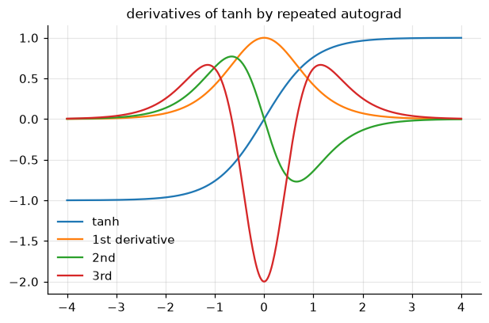
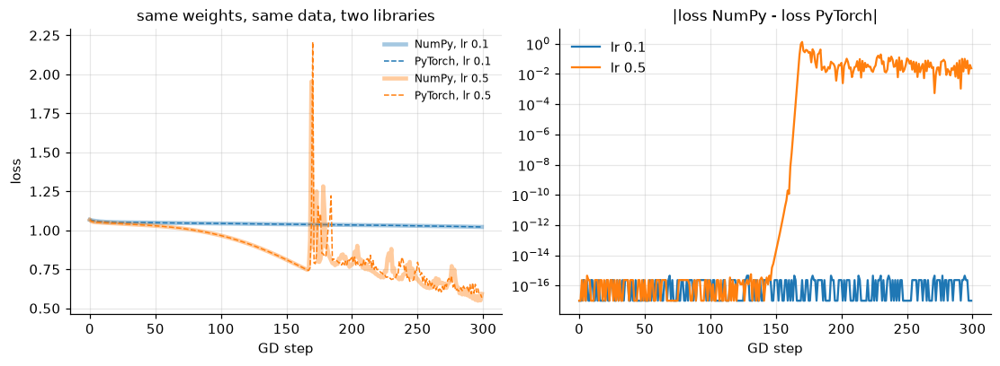

<!-- generated from the root README by nnaz/report.py - edit the root README instead -->
[← 03_training_craft](../03_training_craft/README.md) · [course overview](../../README.md) · [05_cnn_mnist →](../05_cnn_mnist/README.md)

# Lesson 04 - PyTorch basics

📄 [`lessons/04_pytorch_basics/lesson.py`](../../lessons/04_pytorch_basics/lesson.py) · 📓 [`notebooks/04_pytorch_basics.ipynb`](../../notebooks/04_pytorch_basics.ipynb) · code: [`nnaz/torch_basics.py`](../../nnaz/torch_basics.py)

### Autograd = backprop that writes itself

Every operation on a tensor with `requires_grad=True` records a node in a **computational
graph**: `f.grad_fn` points to `AddBackward0`, which points to `MulBackward0` and `SinBackward0`,
and so on. `f.backward()` walks the graph from the output back to the leaves. At each node it
multiplies the incoming gradient by that operation's local Jacobian. This is exactly what our
`Layer.backward` methods did by hand in lesson 02, done automatically for any composition of
operations. This is *reverse-mode* automatic differentiation: one backward sweep gives the
gradient with respect to **all** inputs, which is ideal for one scalar loss and millions of
parameters. It is not finite differences, so the derivatives are exact up to round-off.

Because the backward pass is itself built from differentiable operations, we can differentiate
again. `torch.autograd.grad(..., create_graph=True)` gives second and third derivatives. PINNs
(lesson 09) and Hamiltonian networks (lesson 15) rely on this.

A **custom operation** subclasses `torch.autograd.Function` and implements both `forward` and
`backward`. Here `softplus(x) = log(1 + e^x)` with derivative `sigmoid(x)`. It is verified with
`torch.autograd.gradcheck`, PyTorch's built-in version of our lesson-02 gradient check.

<p align="center"></p>

### The canonical training loop

```python
for epoch in range(epochs):
    model.train()                       # dropout / batch-norm in training mode
    for xb, yb in loader:               # DataLoader shuffles and batches
        opt.zero_grad()                 # gradients ACCUMULATE by default
        loss = loss_fn(model(xb), yb)   # forward: builds the graph
        loss.backward()                 # backward: fills p.grad for every parameter
        opt.step()                      # update using p.grad
    model.eval()
    with torch.no_grad(): ...           # evaluation: no graph, less memory
```

### Same numbers as our NumPy code

We copy the weights of the lesson-02 NumPy MLP into an `nn.Module`. `nn.Linear` stores $W^\top$,
so the weights are transposed. We then run full-batch gradient descent in **both** libraries in
float64. At lr = 0.1 the two loss curves agree to round-off ($10^{-16}$) for 300 steps. At
lr = 0.5 they agree until about step 160, then diverge to $O(1)$ differences. Neither library
is wrong: at that learning rate gradient descent becomes unstable (see the loss spike). The
dynamics turn chaotic and amplify the $10^{-16}$ difference in summation order, just as a
turbulent flow amplifies round-off. This is a useful reminder that bit-for-bit reproducibility
across libraries is only possible in a stable regime.

<p align="center"></p>

<!-- results:04 -->
| check | value |
|---|---|
| autograd vs hand derivative of x²y + sin(xy) | 0.0e+00 |
| custom `MySoftplus` passes `torch.autograd.gradcheck` | True |
| nested autograd: tanh' and tanh'' vs exact formulas | 2.7e-16, 5.4e-16 |
| NumPy vs PyTorch gradients at step 0 (float64) | 1.6e-16 |
| max loss difference over 300 GD steps, lr 0.1 (stable) | 4.4e-16 |
| max loss difference over 300 GD steps, lr 0.5 (unstable, chaotic) | 1.3e+00 |
| PyTorch MLP on spirals: test accuracy | 99.7% |
<!-- /results:04 -->

## Run it

```bash
python lessons/04_pytorch_basics/lesson.py            # script: figures -> docs/lesson04/
jupyter lab notebooks/04_pytorch_basics.ipynb       # the same lesson as a notebook
```

---
[← 03_training_craft](../03_training_craft/README.md) · [course overview](../../README.md) · [05_cnn_mnist →](../05_cnn_mnist/README.md)
