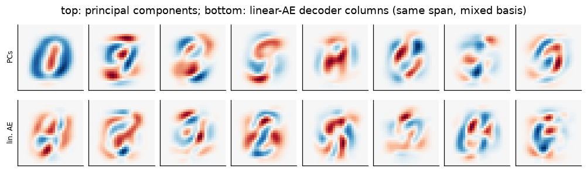
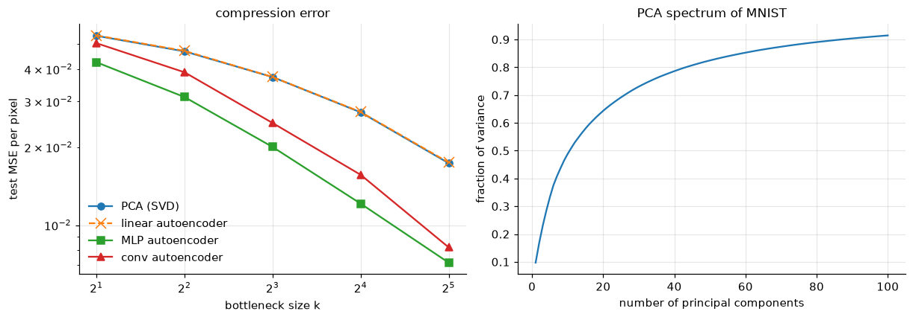
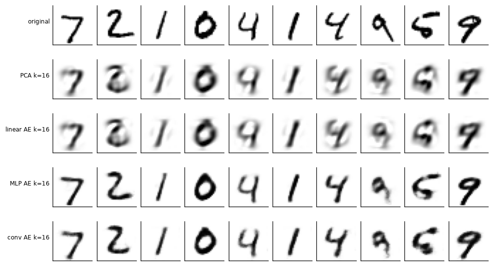
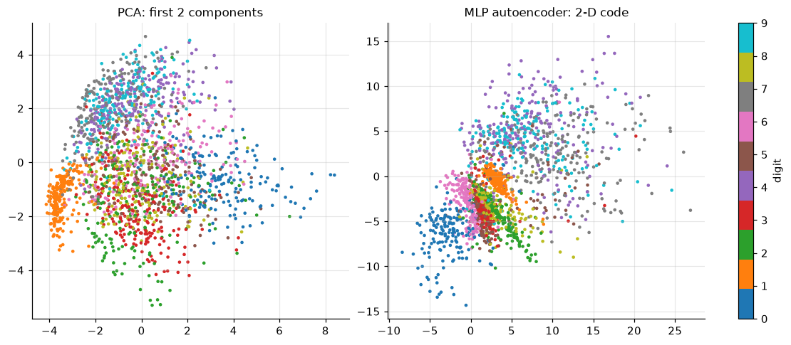
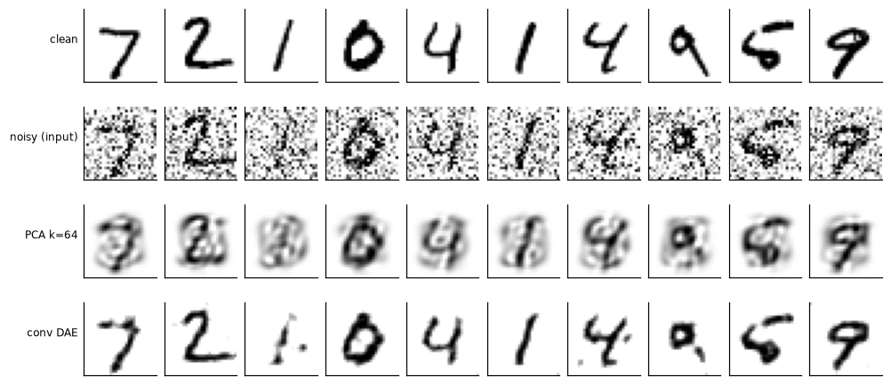

<!-- generated from the root README by nnaz/report.py - edit the root README instead -->
[← 06_rnn_lstm](../06_rnn_lstm/README.md) · [course overview](../../README.md) · [08_attention_gpt →](../08_attention_gpt/README.md)

# Lesson 07 - Autoencoders: compression, denoising, and PCA/SVD

📄 [`lessons/07_autoencoders/lesson.py`](../../lessons/07_autoencoders/lesson.py) · 📓 [`notebooks/07_autoencoders.ipynb`](../../notebooks/07_autoencoders.ipynb) · code: [`nnaz/autoencoder.py`](../../nnaz/autoencoder.py)

### The idea

An autoencoder is an encoder $e:\mathbb R^D\to\mathbb R^k$ and a decoder $d:\mathbb R^k\to\mathbb R^D$,
trained to reproduce its input through a **bottleneck** $k\ll D$:

$$\min_{e,d}\ \frac1N\sum_n\lVert x_n-d(e(x_n))\rVert^2 .$$

The network cannot copy the input, so it must find a compact **code** that captures the
structure of the data. In engineering this is **model-order reduction**: the same idea compresses
CFD snapshots in lesson 16.

### A linear autoencoder *is* PCA, and we can check it exactly

Centre the data, $X-\bar x=U\Sigma V^\top$ (SVD). By the **Eckart-Young theorem**, the best
rank-$k$ approximation in the least-squares sense is the projection onto the first $k$ right
singular vectors, with error $\sum_{i>k}\sigma_i^2/N$. A linear autoencoder
$x\mapsto W_dW_ex$ is a rank-$k$ map, so it cannot beat this. Baldi and Hornik (1989) showed that
all its minima span **the same subspace** as $V_k$. But $W_d$ need not be orthonormal, so the
individual latent coordinates are an arbitrary invertible mixture of the principal components.
We measure both claims: the training MSE against the exact optimum, and the principal angles
between the column space of $W_d$ and $\operatorname{span}(V_k)$.

<p align="center"></p>

### Non-linear and convolutional autoencoders

* **MLP autoencoder**: 784-256-$k$-256-784, ReLU, sigmoid output.
* **Convolutional autoencoder**: strided 3×3 convolutions downsample 28→14→7, a linear layer maps
  to the $k$-dimensional code, and **transposed convolutions** (learnable up-sampling) map back
  7→14→28. It has fewer parameters because of weight sharing (lesson 05).

<p align="center"><br></p>

<!-- results:07 -->
| k | PCA optimum (train) | linear AE (train) | gap | max principal angle | PCA (test) | MLP AE (test) | conv AE (test) |
|---|---|---|---|---|---|---|---|
| 2 | 0.05595 | 0.05605 | 0.2% | 15.1° | 0.05379 | 0.04251 | 0.05037 |
| 4 | 0.04818 | 0.04831 | 0.3% | 32.0° | 0.04683 | 0.03121 | 0.03889 |
| 8 | 0.03787 | 0.03790 | 0.1% | 10.5° | 0.03727 | 0.02003 | 0.02479 |
| 16 | 0.02729 | 0.02736 | 0.2% | 5.4° | 0.02725 | 0.01210 | 0.01564 |
| 32 | 0.01724 | 0.01735 | 0.6% | 9.0° | 0.01734 | 0.00716 | 0.00821 |

| denoiser (σ = 0.5) | PSNR |
|---|---|
| noisy input | 9.37 dB |
| PCA projection (best k = 64) | 15.09 dB |
| convolutional denoising autoencoder | 18.72 dB |

| 2-D code | 5-NN digit accuracy |
|---|---|
| PCA | 41.2% |
| MLP autoencoder | 58.2% |
<!-- /results:07 -->

**Reading the table.**
* The linear AE reaches the Eckart-Young optimum to within 0.1-0.6 %, as theory says.
* The principal angles are small, but not zero, and they are **largest for $k=4$**. When two
  singular values are close ($\sigma_4\approx\sigma_5$), the optimal subspace is ill-conditioned:
  rotating inside the near-degenerate pair costs almost no loss. The angle error scales like
  (loss gap)/(eigenvalue gap). This is a general lesson for POD/PCA with clustered spectra.
* Non-linear autoencoders beat PCA at every $k$. At $k=16$ the MLP AE halves the error, because
  the digit manifold is curved and a linear subspace wastes dimensions.
* The convolutional AE is trained for **one third of the epochs** (it costs about 5× more per
  epoch on a CPU), so it is *not* a fair loss comparison. We report it as run.
* In 2-D the non-linear code separates the digit classes much better than the PCA plane
  (5-NN accuracy in the table).

<p align="center"></p>

### Denoising

Train with **corrupted inputs and clean targets**, $\min\lVert x-f(x+\eta)\rVert^2$ with
$\eta\sim\mathcal N(0,0.5^2)$. The network must learn what digits look like in order to remove
what does not belong. The baseline is **projection onto the top-$k$ principal components**,
which is classical linear denoising (we report the best $k$). Our denoiser is a small fully
convolutional network with **residual learning** (Zhang et al. 2017): it predicts the correction
$f(\tilde x)$ and outputs $\tilde x+f(\tilde x)$, starting from the identity map.

<p align="center"></p>

The convolutional denoiser gains about 9 dB over the noisy input and about 3.5 dB over the best
PCA projection. It knows what strokes look like *locally*, at every position (weight sharing),
whereas PCA can only keep or discard global components.

## Run it

```bash
python lessons/07_autoencoders/lesson.py            # script: figures -> docs/lesson07/
jupyter lab notebooks/07_autoencoders.ipynb       # the same lesson as a notebook
```

---
[← 06_rnn_lstm](../06_rnn_lstm/README.md) · [course overview](../../README.md) · [08_attention_gpt →](../08_attention_gpt/README.md)
