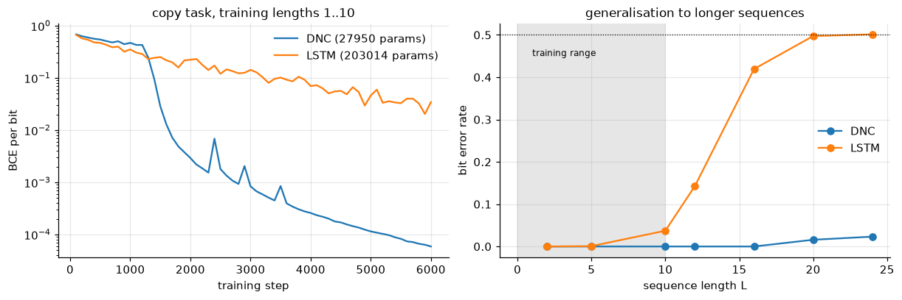
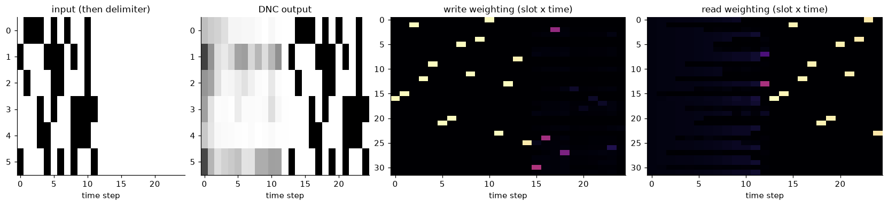

<!-- generated from the root README by nnaz/report.py - edit the root README instead -->
[← 11_som_hopfield](../11_som_hopfield/README.md) · [course overview](../../README.md) · [13_graph_nn_mesh →](../13_graph_nn_mesh/README.md)

# Lesson 12 - The Differentiable Neural Computer (memory-augmented networks)

📄 [`lessons/12_dnc_memory/lesson.py`](../../lessons/12_dnc_memory/lesson.py) · 📓 [`notebooks/12_dnc_memory.ipynb`](../../notebooks/12_dnc_memory.ipynb) · code: [`nnaz/dnc.py`](../../nnaz/dnc.py)

An LSTM stores everything in a fixed-size state vector. To remember more, it must grow its
weights. A **Differentiable Neural Computer** (Graves et al., *Nature* 2016) separates computing
from storage. A neural **controller** (here a small LSTM) reads and writes an external
**memory matrix** $M\in\mathbb R^{N\times W}$ (32 slots × 16 numbers). All memory access is
*soft attention* over slots, so the whole machine is differentiable and trains with ordinary
backpropagation. At every step the controller emits an **interface vector** that sets:

| mechanism | equations | purpose |
|---|---|---|
| content addressing | $c=\operatorname{softmax}\big(\beta\cos(M_i,k)\big)$ | find a slot by *what* it contains |
| usage & allocation | $u\leftarrow(u+w^w-u\odot w^w)\odot\prod_r(1-f_rw^r_r)$; $a_{\phi_j}=(1-u_{\phi_j})\prod_{i<j}u_{\phi_i}$ | find *free* slots ($\phi$ = slots sorted by usage) |
| write | $w^w=g^w\,(g^a a+(1-g^a)c^w)$; $M\leftarrow M\odot(1-w^we^\top)+w^wv^\top$ | erase, then add |
| temporal links | $L_{ij}\leftarrow(1-w^w_i-w^w_j)L_{ij}+w^w_ip_j$; $p\leftarrow(1-\sum w^w)p+w^w$ | remember the *order* of writes |
| read | $w^r=\pi_1(L^\top w^r)+\pi_2c^r+\pi_3(Lw^r)$; $r=M^\top w^r$ | read backwards, by content, or forwards |

**The copy task.** The network reads $L$ random 6-bit vectors and a delimiter, then must output
the same $L$ vectors. It is trained on $L\in[1,10]$ and tested up to $L=24$. A DNC can solve
this with an *algorithm*: write each input to a fresh (allocated) slot, then follow the
temporal links forward while reading. That algorithm does not depend on $L$, as long as the
memory has enough slots.

<p align="center"><br></p>

Each input is written to one fresh slot: a single bright cell per time step. The slots are
scattered because allocation picks whichever slots are least used. During the output phase, the
read weightings visit **exactly the same slots in the same order**. The network has discovered
"allocate, write, then follow the temporal links" by itself. This is why it keeps working at
lengths it never saw, until the 32 slots start to run out (the few errors at $L\ge20$).

<!-- results:12 -->
| bit error rate at length L | L=2 (train) | L=5 (train) | L=10 (train) | L=12 | L=16 | L=20 | L=24 |
|---|---|---|---|---|---|---|---|
| DNC | 0.000 | 0.000 | 0.000 | 0.000 | 0.000 | 0.016 | 0.023 |
| LSTM | 0.000 | 0.001 | 0.037 | 0.143 | 0.419 | 0.497 | 0.501 |

Parameters: DNC 27,950 (LSTM controller 64 + 32 × 16 memory), LSTM baseline 203,014 (2 × 128). Training: 6000 steps; DNC 6.5 min, LSTM 0.8 min on CPU. Chance level is 0.5.
<!-- /results:12 -->

## Run it

```bash
python lessons/12_dnc_memory/lesson.py            # script: figures -> docs/lesson12/
jupyter lab notebooks/12_dnc_memory.ipynb       # the same lesson as a notebook
```

---
[← 11_som_hopfield](../11_som_hopfield/README.md) · [course overview](../../README.md) · [13_graph_nn_mesh →](../13_graph_nn_mesh/README.md)
