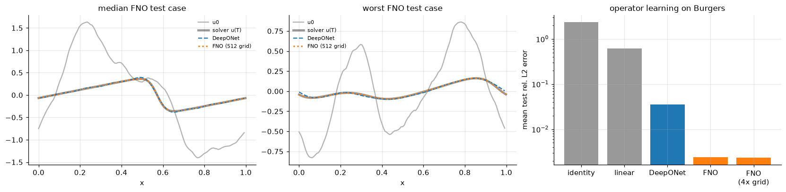
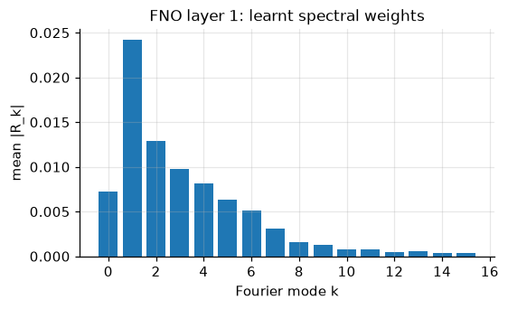

<!-- generated from the root README by nnaz/report.py - edit the root README instead -->
[← 13_graph_nn_mesh](../13_graph_nn_mesh/README.md) · [course overview](../../README.md) · [15_hamiltonian_neural_ode →](../15_hamiltonian_neural_ode/README.md)

# Lesson 14 - Neural operators: DeepONet and the Fourier Neural Operator

📄 [`lessons/14_neural_operators/lesson.py`](../../lessons/14_neural_operators/lesson.py) · 📓 [`notebooks/14_neural_operators.ipynb`](../../notebooks/14_neural_operators.ipynb) · code: [`nnaz/operators.py`](../../nnaz/operators.py)

A PINN (lesson 09) solves **one** PDE instance. A parameter surrogate maps a few numbers to a
solution. A **neural operator** learns the whole *solution operator*, a map between function
spaces. Here it is $\mathcal G:u_0(\cdot)\mapsto u(\cdot,T)$ for viscous Burgers on a periodic
domain. After training, one forward pass solves the PDE for **any** new initial condition.

**Data.** $u_0$ is drawn from a periodic Gaussian random field with covariance
$\sigma^2(-\Delta+\tau^2)^{-2}$, as in the FNO paper. The PDE $u_t+(u^2/2)_x=\nu u_{xx}$ with
$\nu=0.01$ is solved to $T=1$ with our **pseudo-spectral** solver: Fourier derivatives, 2/3-rule
de-aliasing, and an **integrating factor** $e^{\nu k^2t}$ that treats diffusion exactly. With
diffusion handled exactly, RK4 time steps are limited only by advection. The solver agrees with
the exact Cole-Hopf solution to $10^{-10}$. We use 1000 training and 200 test pairs on a 128-point
grid (the data are solved on 512 points and subsampled).

**DeepONet** (Lu et al., 2021) is inspired by the universal approximation theorem for operators:

$$ \mathcal G(u_0)(x)\approx\sum_{k=1}^{p} \underbrace{b_k\big(u_0(x_1),\dots,u_0(x_m)\big)}_{\text{branch net}}\;\underbrace{t_k(x)}_{\text{trunk net}}+b_0 . $$

The branch net reads the input function at $m$ fixed sensors and produces coefficients. The
trunk net produces basis functions of the query location $x$, encoded as $(\cos2\pi x,\sin2\pi x)$
so periodicity is built in. It is a learnt, nonlinear reduced-basis expansion.

**FNO** (Li et al., 2021) stacks layers that combine a pointwise linear map with a **global
convolution learnt in Fourier space**:

$$ v\leftarrow\sigma\Big(Wv+\mathcal F^{-1}\big[R_k\cdot\mathcal F[v]_k\big]_{k\le k_\max}\Big). $$

The weights $R_k$ live on the lowest $k_\max=16$ Fourier modes, not on grid points. The same
trained network can therefore be evaluated on a **finer grid** than it was trained on
(zero-shot super-resolution). We test that on the 512-point grid.

<p align="center"><br></p>

<!-- results:14 -->
| operator (test set, 200 new u0) | mean relative L2 error |
|---|---|
| identity  u(T) = u0 | 2.374 |
| best linear operator (least squares) | 0.614 |
| DeepONet | 0.0357 |
| FNO | **0.0024** |
| FNO evaluated on the 512-point grid (trained on 128) | 0.0023 |
| DeepONet queried at 512 points | 0.0357 |

Cost per sample: spectral solver 129 ms (batched), FNO 1.01 ms. Training on CPU: DeepONet 58 s, FNO 375 s. The solver's own resolution check (2× finer grid): 2.4e-12.
<!-- /results:14 -->

**Reading the numbers.**
* The identity baseline is terrible: the solution decays and steepens a lot by $T=1$.
* Even the *best possible linear* operator, a full $128\times128$ matrix fitted by least squares,
  leaves 61 % error. The map is genuinely nonlinear: shocks form and interact.
* DeepONet brings this down to about 4 %.
* The FNO reaches 0.24 %, about 15× better. Its inductive bias, global convolutions on
  low Fourier modes, matches a translation-invariant PDE on a periodic domain.
* Evaluated on a 4× finer grid than it saw in training, the FNO keeps the same accuracy, because
  its weights live on Fourier modes, not grid points. DeepONet can also be *queried* at any $x$,
  but its input must still be sampled at the original 128 sensors.
* Once trained, the FNO costs about 1 ms per solution against about 130 ms for the (batched)
  spectral solver. Training took about 6 CPU minutes, so the investment pays off after a few
  thousand solves: typical of design loops and uncertainty quantification. For a handful of
  solves, just run the solver.

## Run it

```bash
python lessons/14_neural_operators/lesson.py            # script: figures -> docs/lesson14/
jupyter lab notebooks/14_neural_operators.ipynb       # the same lesson as a notebook
```

---
[← 13_graph_nn_mesh](../13_graph_nn_mesh/README.md) · [course overview](../../README.md) · [15_hamiltonian_neural_ode →](../15_hamiltonian_neural_ode/README.md)
